# Admin Side - Detailed Sequence Diagrams
## CNPS Smart Automated Analytics System

---

## Table of Contents

1. [Admin Dashboard Overview](#1-admin-dashboard-overview)
2. [Department Management](#2-department-management)
3. [User & Role Management](#3-user--role-management)
4. [Semantic Template Management](#4-semantic-template-management)
5. [Instance Template Management](#5-instance-template-management)
6. [Data Quality & Validation Audit](#6-data-quality--validation-audit)
7. [Cross-Feature Workflows](#7-cross-feature-workflows)
8. [Admin Offline Mode](#8-admin-offline-mode)

---

## 1. Admin Dashboard Overview

### 1.1 Admin Dashboard Initial Load

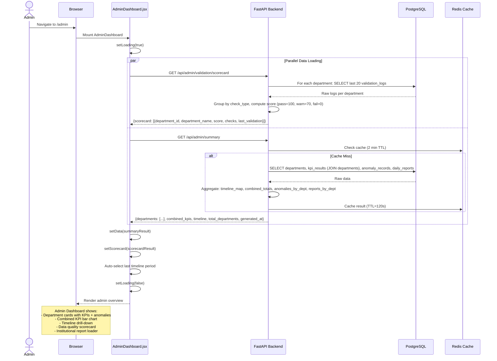
```mermaid
sequenceDiagram
    actor A as Admin
    participant BR as Browser
    participant React as AdminDashboard.jsx
    participant BE as FastAPI Backend
    participant DB as PostgreSQL
    participant Redis as Redis Cache

    A->>BR: Navigate to /admin
    BR->>React: Mount AdminDashboard
    React->>React: setLoading(true)

    par Parallel Data Loading
        React->>BE: GET /api/admin/validation/scorecard
        BE->>DB: For each department: SELECT last 20 validation_logs
        DB-->>BE: Raw logs per department
        BE->>BE: Group by check_type, compute score (pass=100, warn=70, fail=0)
        BE-->>React: {scorecard: [{department_id, department_name, score, checks, last_validation}]}
    and
        React->>BE: GET /api/admin/summary
        BE->>Redis: Check cache (2 min TTL)
        alt Cache Miss
            BE->>DB: SELECT departments, kpi_results (JOIN departments), anomaly_records, daily_reports
            DB-->>BE: Raw data
            BE->>BE: Aggregate: timeline_map, combined_totals, anomalies_by_dept, reports_by_dept
            BE->>Redis: Cache result (TTL=120s)
        end
        BE-->>React: {departments: [...], combined_kpis, timeline, total_departments, generated_at}
    end

    React->>React: setData(summaryResult)
    React->>React: setScorecard(scorecardResult)
    React->>React: Auto-select last timeline period
    React->>React: setLoading(false)
    React-->>BR: Render admin overview

    Note over BR: Admin Dashboard shows:<br/>- Department cards with KPIs + anomalies<br/>- Combined KPI bar chart<br/>- Timeline drill-down<br/>- Data quality scorecard<br/>- Institutional report loader
```

### 1.2 Admin Dashboard - KPI Lineage Drill-Down

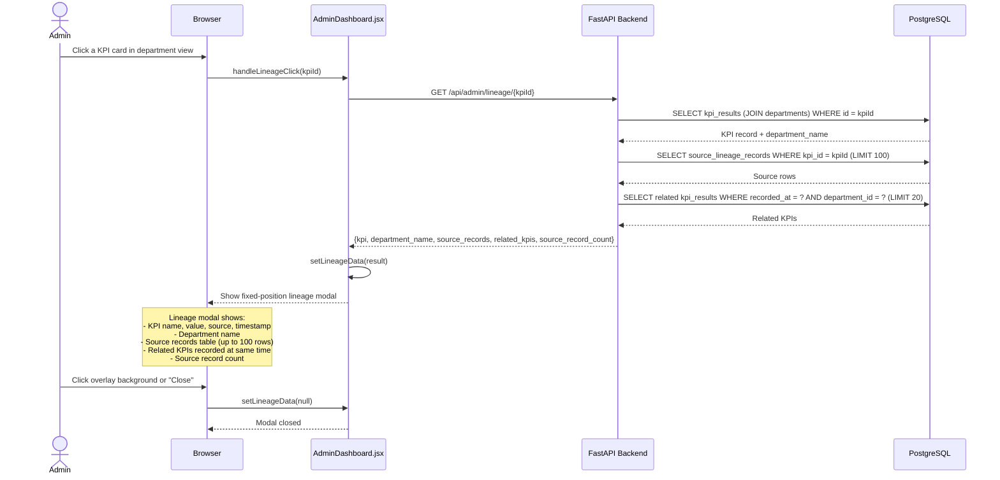
```mermaid
sequenceDiagram
    actor A as Admin
    participant BR as Browser
    participant React as AdminDashboard.jsx
    participant BE as FastAPI Backend
    participant DB as PostgreSQL

    A->>BR: Click a KPI card in department view
    BR->>React: handleLineageClick(kpiId)
    React->>BE: GET /api/admin/lineage/{kpiId}
    BE->>DB: SELECT kpi_results (JOIN departments) WHERE id = kpiId
    DB-->>BE: KPI record + department_name
    BE->>DB: SELECT source_lineage_records WHERE kpi_id = kpiId (LIMIT 100)
    DB-->>BE: Source rows
    BE->>DB: SELECT related kpi_results WHERE recorded_at = ? AND department_id = ? (LIMIT 20)
    DB-->>BE: Related KPIs
    BE-->>React: {kpi, department_name, source_records, related_kpis, source_record_count}
    React->>React: setLineageData(result)
    React-->>BR: Show fixed-position lineage modal

    Note over BR: Lineage modal shows:<br/>- KPI name, value, source, timestamp<br/>- Department name<br/>- Source records table (up to 100 rows)<br/>- Related KPIs recorded at same time<br/>- Source record count

    A->>BR: Click overlay background or "Close"
    BR->>React: setLineageData(null)
    React-->>BR: Modal closed
```

### 1.3 Admin Dashboard - Combined Report

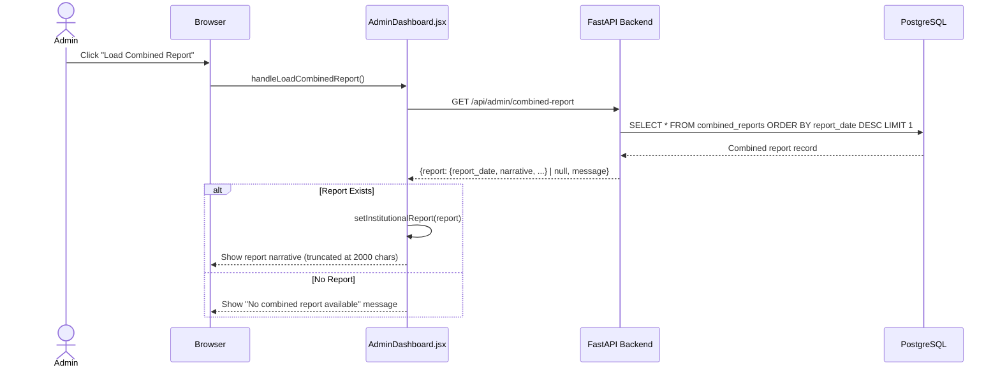
```mermaid
sequenceDiagram
    actor A as Admin
    participant BR as Browser
    participant React as AdminDashboard.jsx
    participant BE as FastAPI Backend
    participant DB as PostgreSQL

    A->>BR: Click "Load Combined Report"
    BR->>React: handleLoadCombinedReport()
    React->>BE: GET /api/admin/combined-report
    BE->>DB: SELECT * FROM combined_reports ORDER BY report_date DESC LIMIT 1
    DB-->>BE: Combined report record
    BE-->>React: {report: {report_date, narrative, ...} | null, message}
    alt Report Exists
        React->>React: setInstitutionalReport(report)
        React-->>BR: Show report narrative (truncated at 2000 chars)
    else No Report
        React-->>BR: Show "No combined report available" message
    end
```

### 1.4 Admin Dashboard - Global Sync

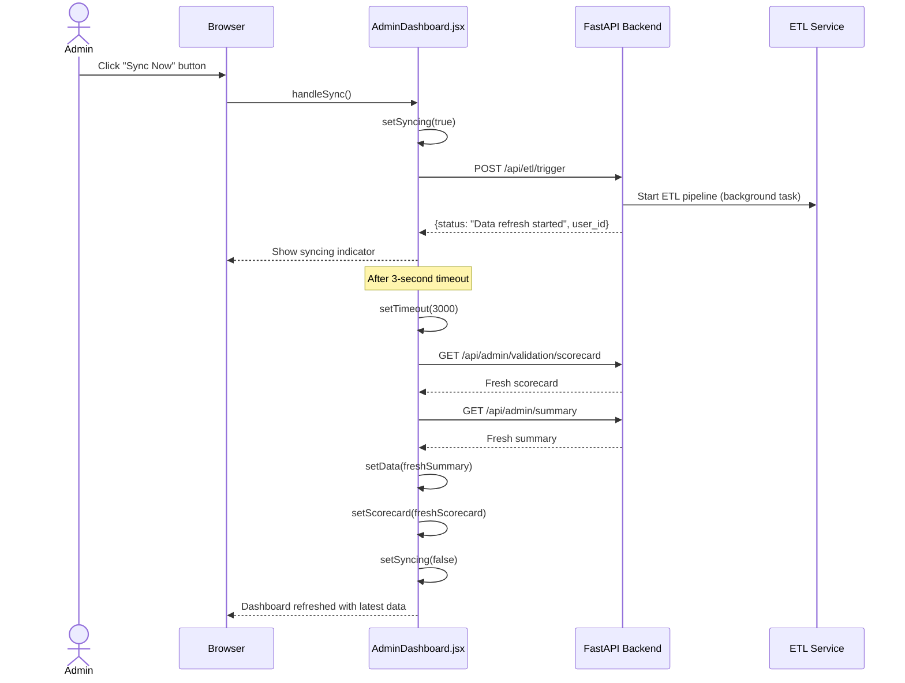
```mermaid
sequenceDiagram
    actor A as Admin
    participant BR as Browser
    participant React as AdminDashboard.jsx
    participant BE as FastAPI Backend
    participant ETL as ETL Service

    A->>BR: Click "Sync Now" button
    BR->>React: handleSync()
    React->>React: setSyncing(true)
    React->>BE: POST /api/etl/trigger
    BE->>ETL: Start ETL pipeline (background task)
    BE-->>React: {status: "Data refresh started", user_id}
    React-->>BR: Show syncing indicator

    Note over React: After 3-second timeout
    React->>React: setTimeout(3000)
    React->>BE: GET /api/admin/validation/scorecard
    BE-->>React: Fresh scorecard
    React->>BE: GET /api/admin/summary
    BE-->>React: Fresh summary
    React->>React: setData(freshSummary)
    React->>React: setScorecard(freshScorecard)
    React->>React: setSyncing(false)
    React-->>BR: Dashboard refreshed with latest data
```

### 1.5 Admin Dashboard - Timeline Drill-Down

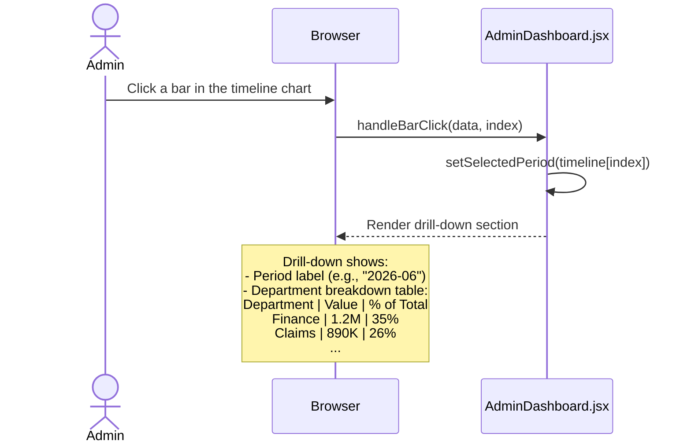
```mermaid
sequenceDiagram
    actor A as Admin
    participant BR as Browser
    participant React as AdminDashboard.jsx

    A->>BR: Click a bar in the timeline chart
    BR->>React: handleBarClick(data, index)
    React->>React: setSelectedPeriod(timeline[index])
    React-->>BR: Render drill-down section

    Note over BR: Drill-down shows:<br/>- Period label (e.g., "2026-06")<br/>- Department breakdown table:<br/>  Department | Value | % of Total<br/>  Finance    | 1.2M  | 35%<br/>  Claims     | 890K  | 26%<br/>  ...
```

---

## 2. Department Management

### 2.1 Department List Load

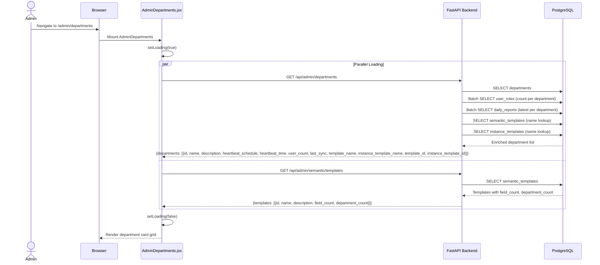
```mermaid
sequenceDiagram
    actor A as Admin
    participant BR as Browser
    participant React as AdminDepartments.jsx
    participant BE as FastAPI Backend
    participant DB as PostgreSQL

    A->>BR: Navigate to /admin/departments
    BR->>React: Mount AdminDepartments
    React->>React: setLoading(true)

    par Parallel Loading
        React->>BE: GET /api/admin/departments
        BE->>DB: SELECT departments
        BE->>DB: Batch SELECT user_roles (count per department)
        BE->>DB: Batch SELECT daily_reports (latest per department)
        BE->>DB: SELECT semantic_templates (name lookup)
        BE->>DB: SELECT instance_templates (name lookup)
        DB-->>BE: Enriched department list
        BE-->>React: {departments: [{id, name, description, heartbeat_schedule, heartbeat_time, user_count, last_sync, template_name, instance_template_name, template_id, instance_template_id}]}
    and
        React->>BE: GET /api/admin/semantic/templates
        BE->>DB: SELECT semantic_templates
        DB-->>BE: Templates with field_count, department_count
        BE-->>React: {templates: [{id, name, description, field_count, department_count}]}
    end

    React->>React: setLoading(false)
    React-->>BR: Render department card grid
```

### 2.2 Create Department

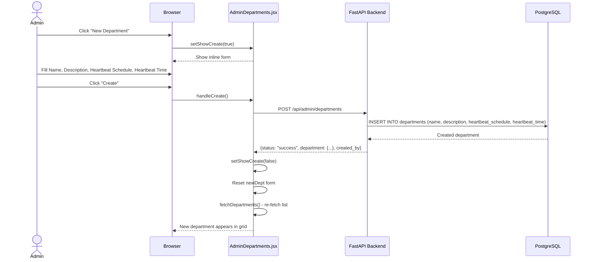
```mermaid
sequenceDiagram
    actor A as Admin
    participant BR as Browser
    participant React as AdminDepartments.jsx
    participant BE as FastAPI Backend
    participant DB as PostgreSQL

    A->>BR: Click "New Department"
    BR->>React: setShowCreate(true)
    React-->>BR: Show inline form

    A->>BR: Fill Name, Description, Heartbeat Schedule, Heartbeat Time
    A->>BR: Click "Create"
    BR->>React: handleCreate()
    React->>BE: POST /api/admin/departments
    BE->>DB: INSERT INTO departments (name, description, heartbeat_schedule, heartbeat_time)
    DB-->>BE: Created department
    BE-->>React: {status: "success", department: {...}, created_by}
    React->>React: setShowCreate(false)
    React->>React: Reset newDept form
    React->>React: fetchDepartments() - re-fetch list
    React-->>BR: New department appears in grid
```

### 2.3 Assign Semantic Template to Department

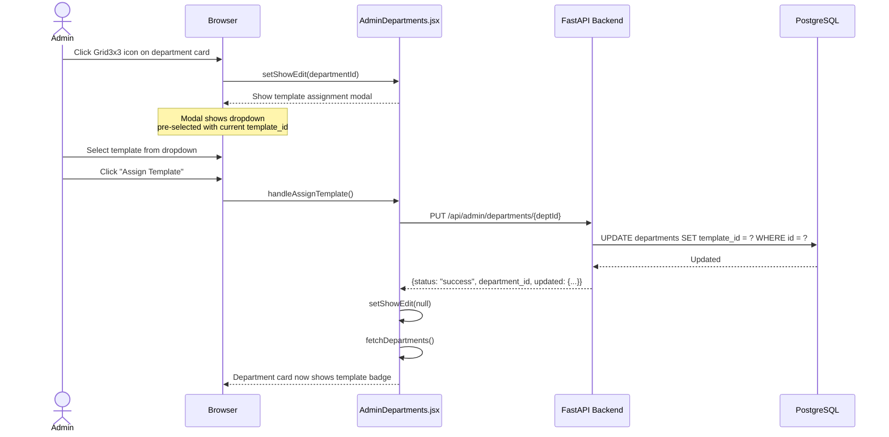
```mermaid
sequenceDiagram
    actor A as Admin
    participant BR as Browser
    participant React as AdminDepartments.jsx
    participant BE as FastAPI Backend
    participant DB as PostgreSQL

    A->>BR: Click Grid3x3 icon on department card
    BR->>React: setShowEdit(departmentId)
    React-->>BR: Show template assignment modal

    Note over BR: Modal shows dropdown<br/>pre-selected with current template_id

    A->>BR: Select template from dropdown
    A->>BR: Click "Assign Template"
    BR->>React: handleAssignTemplate()
    React->>BE: PUT /api/admin/departments/{deptId}
    BE->>DB: UPDATE departments SET template_id = ? WHERE id = ?
    DB-->>BE: Updated
    BE-->>React: {status: "success", department_id, updated: {...}}
    React->>React: setShowEdit(null)
    React->>React: fetchDepartments()
    React-->>BR: Department card now shows template badge
```

### 2.4 Delete Department

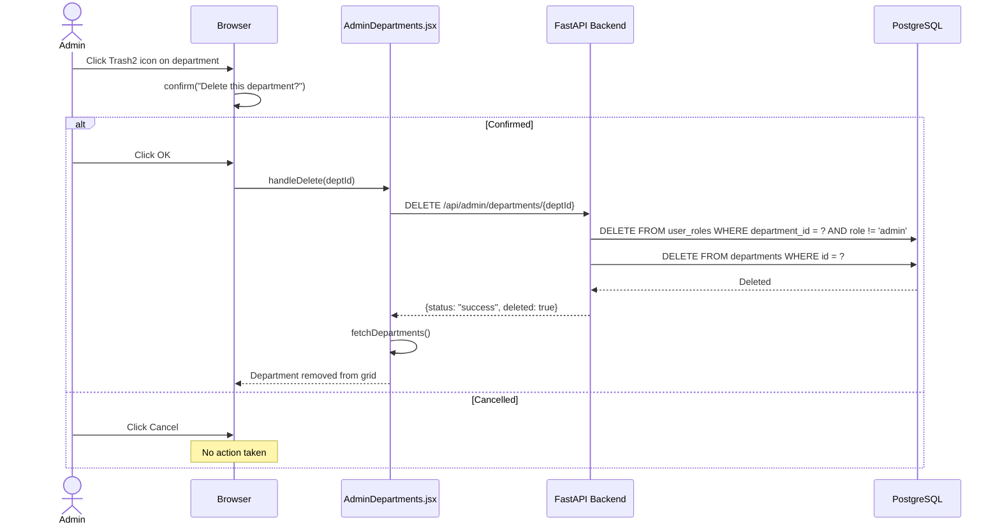
```mermaid
sequenceDiagram
    actor A as Admin
    participant BR as Browser
    participant React as AdminDepartments.jsx
    participant BE as FastAPI Backend
    participant DB as PostgreSQL

    A->>BR: Click Trash2 icon on department
    BR->>BR: confirm("Delete this department?")
    alt Confirmed
        A->>BR: Click OK
        BR->>React: handleDelete(deptId)
        React->>BE: DELETE /api/admin/departments/{deptId}
        BE->>DB: DELETE FROM user_roles WHERE department_id = ? AND role != 'admin'
        BE->>DB: DELETE FROM departments WHERE id = ?
        DB-->>BE: Deleted
        BE-->>React: {status: "success", deleted: true}
        React->>React: fetchDepartments()
        React-->>BR: Department removed from grid
    else Cancelled
        A->>BR: Click Cancel
        Note over BR: No action taken
    end
```

### 2.5 Trigger Department ETL

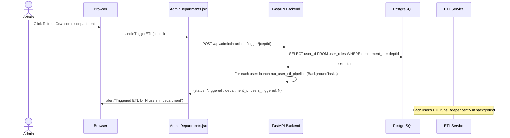
```mermaid
sequenceDiagram
    actor A as Admin
    participant BR as Browser
    participant React as AdminDepartments.jsx
    participant BE as FastAPI Backend
    participant DB as PostgreSQL
    participant ETL as ETL Service

    A->>BR: Click RefreshCcw icon on department
    BR->>React: handleTriggerETL(deptId)
    React->>BE: POST /api/admin/heartbeat/trigger/{deptId}
    BE->>DB: SELECT user_id FROM user_roles WHERE department_id = deptId
    DB-->>BE: User list
    BE->>BE: For each user: launch run_user_etl_pipeline (BackgroundTasks)
    BE-->>React: {status: "triggered", department_id, users_triggered: N}
    React->>BR: alert("Triggered ETL for N users in department")
    Note over ETL: Each user's ETL runs independently in background
```

---

## 3. User & Role Management

### 3.1 User List Load

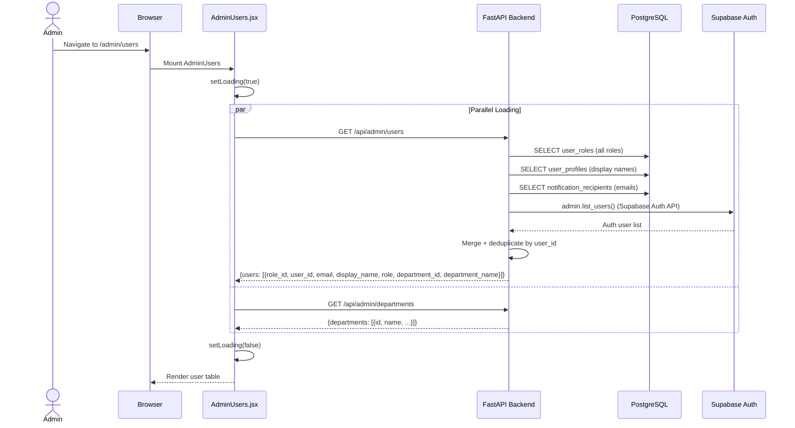
```mermaid
sequenceDiagram
    actor A as Admin
    participant BR as Browser
    participant React as AdminUsers.jsx
    participant BE as FastAPI Backend
    participant DB as PostgreSQL
    participant SB as Supabase Auth

    A->>BR: Navigate to /admin/users
    BR->>React: Mount AdminUsers
    React->>React: setLoading(true)

    par Parallel Loading
        React->>BE: GET /api/admin/users
        BE->>DB: SELECT user_roles (all roles)
        BE->>DB: SELECT user_profiles (display names)
        BE->>DB: SELECT notification_recipients (emails)
        BE->>SB: admin.list_users() (Supabase Auth API)
        SB-->>BE: Auth user list
        BE->>BE: Merge + deduplicate by user_id
        BE-->>React: {users: [{role_id, user_id, email, display_name, role, department_id, department_name}]}
    and
        React->>BE: GET /api/admin/departments
        BE-->>React: {departments: [{id, name, ...}]}
    end

    React->>React: setLoading(false)
    React-->>BR: Render user table
```

### 3.2 Assign/Change Role

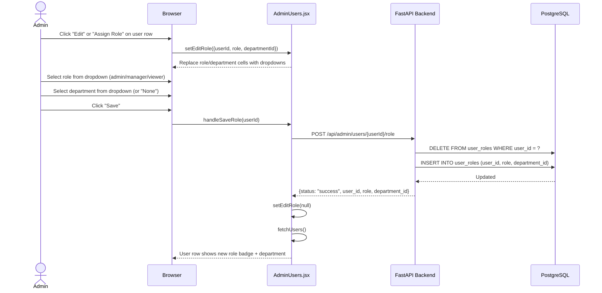
```mermaid
sequenceDiagram
    actor A as Admin
    participant BR as Browser
    participant React as AdminUsers.jsx
    participant BE as FastAPI Backend
    participant DB as PostgreSQL

    A->>BR: Click "Edit" or "Assign Role" on user row
    BR->>React: setEditRole({userId, role, departmentId})
    React-->>BR: Replace role/department cells with dropdowns

    A->>BR: Select role from dropdown (admin/manager/viewer)
    A->>BR: Select department from dropdown (or "None")
    A->>BR: Click "Save"
    BR->>React: handleSaveRole(userId)
    React->>BE: POST /api/admin/users/{userId}/role
    BE->>DB: DELETE FROM user_roles WHERE user_id = ?
    BE->>DB: INSERT INTO user_roles (user_id, role, department_id)
    DB-->>BE: Updated
    BE-->>React: {status: "success", user_id, role, department_id}
    React->>React: setEditRole(null)
    React->>React: fetchUsers()
    React-->>BR: User row shows new role badge + department
```

### 3.3 Remove User Role

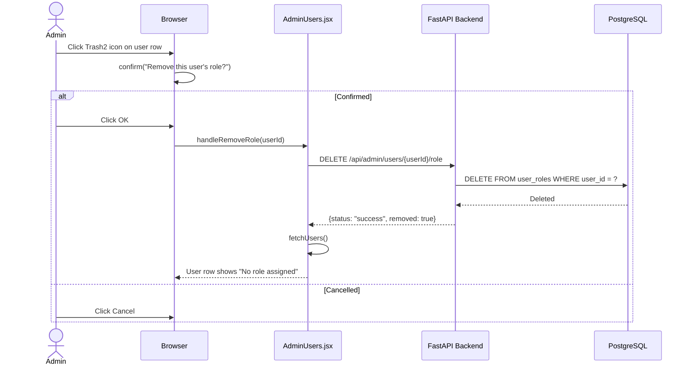
```mermaid
sequenceDiagram
    actor A as Admin
    participant BR as Browser
    participant React as AdminUsers.jsx
    participant BE as FastAPI Backend
    participant DB as PostgreSQL

    A->>BR: Click Trash2 icon on user row
    BR->>BR: confirm("Remove this user's role?")
    alt Confirmed
        A->>BR: Click OK
        BR->>React: handleRemoveRole(userId)
        React->>BE: DELETE /api/admin/users/{userId}/role
        BE->>DB: DELETE FROM user_roles WHERE user_id = ?
        DB-->>BE: Deleted
        BE-->>React: {status: "success", removed: true}
        React->>React: fetchUsers()
        React-->>BR: User row shows "No role assigned"
    else Cancelled
        A->>BR: Click Cancel
    end
```

### 3.4 Role Badge Color System

```
┌──────────┬─────────────┬──────────────────────────────┐
│ Role     │ Color       │ Meaning                      │
├──────────┼─────────────┼──────────────────────────────┤
│ admin    │ Amber/Gold  │ Full system access           │
│ manager  │ Blue        │ Feature access (non-admin)   │
│ viewer   │ Gray        │ Read-only dashboard access   │
│ (none)   │ Red outline │ Auto-assigned to "General"   │
└──────────┴─────────────┴──────────────────────────────┘
```

---

## 4. Semantic Template Management

### 4.1 Template List & Field Explorer

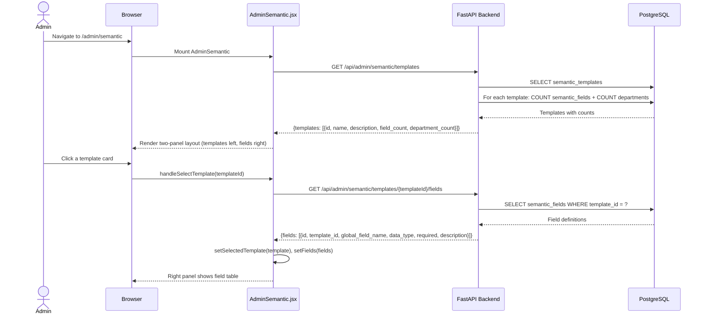
```mermaid
sequenceDiagram
    actor A as Admin
    participant BR as Browser
    participant React as AdminSemantic.jsx
    participant BE as FastAPI Backend
    participant DB as PostgreSQL

    A->>BR: Navigate to /admin/semantic
    BR->>React: Mount AdminSemantic
    React->>BE: GET /api/admin/semantic/templates
    BE->>DB: SELECT semantic_templates
    BE->>DB: For each template: COUNT semantic_fields + COUNT departments
    DB-->>BE: Templates with counts
    BE-->>React: {templates: [{id, name, description, field_count, department_count}]}
    React-->>BR: Render two-panel layout (templates left, fields right)

    A->>BR: Click a template card
    BR->>React: handleSelectTemplate(templateId)
    React->>BE: GET /api/admin/semantic/templates/{templateId}/fields
    BE->>DB: SELECT semantic_fields WHERE template_id = ?
    DB-->>BE: Field definitions
    BE-->>React: {fields: [{id, template_id, global_field_name, data_type, required, description}]}
    React->>React: setSelectedTemplate(template), setFields(fields)
    React-->>BR: Right panel shows field table
```

### 4.2 Create Semantic Template

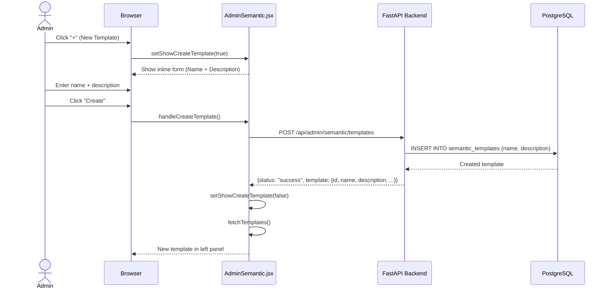
```mermaid
sequenceDiagram
    actor A as Admin
    participant BR as Browser
    participant React as AdminSemantic.jsx
    participant BE as FastAPI Backend
    participant DB as PostgreSQL

    A->>BR: Click "+" (New Template)
    BR->>React: setShowCreateTemplate(true)
    React-->>BR: Show inline form (Name + Description)

    A->>BR: Enter name + description
    A->>BR: Click "Create"
    BR->>React: handleCreateTemplate()
    React->>BE: POST /api/admin/semantic/templates
    BE->>DB: INSERT INTO semantic_templates (name, description)
    DB-->>BE: Created template
    BE-->>React: {status: "success", template: {id, name, description, ...}}
    React->>React: setShowCreateTemplate(false)
    React->>React: fetchTemplates()
    React-->>BR: New template in left panel
```

### 4.3 Add Field to Template

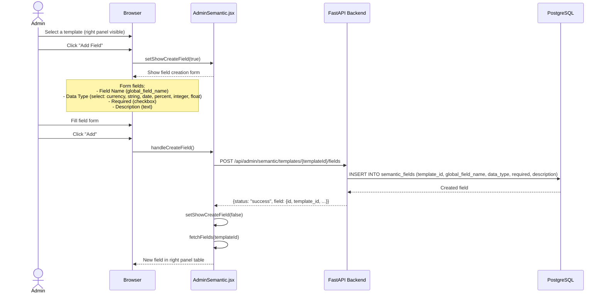
```mermaid
sequenceDiagram
    actor A as Admin
    participant BR as Browser
    participant React as AdminSemantic.jsx
    participant BE as FastAPI Backend
    participant DB as PostgreSQL

    A->>BR: Select a template (right panel visible)
    A->>BR: Click "Add Field"
    BR->>React: setShowCreateField(true)
    React-->>BR: Show field creation form

    Note over BR: Form fields:<br/>- Field Name (global_field_name)<br/>- Data Type (select: currency, string, date, percent, integer, float)<br/>- Required (checkbox)<br/>- Description (text)

    A->>BR: Fill field form
    A->>BR: Click "Add"
    BR->>React: handleCreateField()
    React->>BE: POST /api/admin/semantic/templates/{templateId}/fields
    BE->>DB: INSERT INTO semantic_fields (template_id, global_field_name, data_type, required, description)
    DB-->>BE: Created field
    BE-->>React: {status: "success", field: {id, template_id, ...}}
    React->>React: setShowCreateField(false)
    React->>React: fetchFields(templateId)
    React-->>BR: New field in right panel table
```

### 4.4 Delete Template / Delete Field

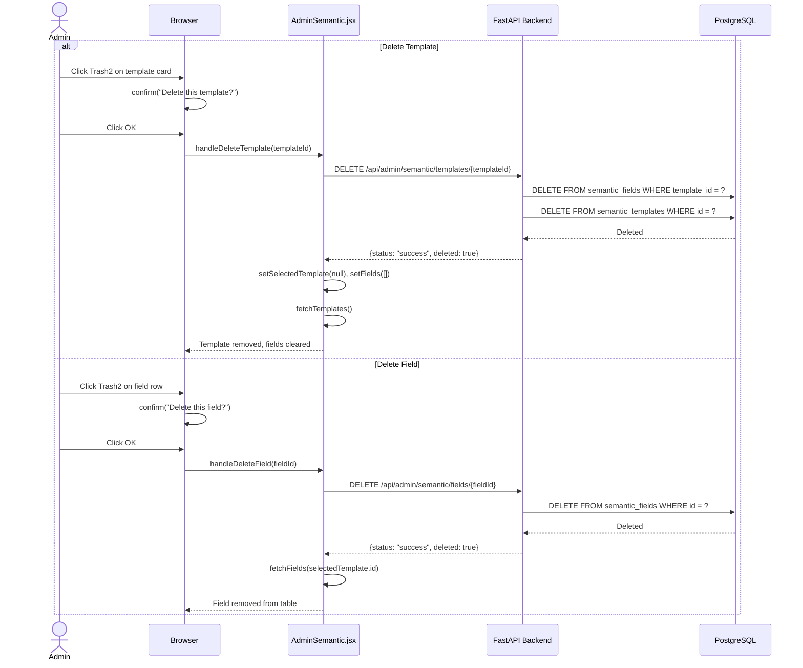
```mermaid
sequenceDiagram
    actor A as Admin
    participant BR as Browser
    participant React as AdminSemantic.jsx
    participant BE as FastAPI Backend
    participant DB as PostgreSQL

    alt Delete Template
        A->>BR: Click Trash2 on template card
        BR->>BR: confirm("Delete this template?")
        A->>BR: Click OK
        BR->>React: handleDeleteTemplate(templateId)
        React->>BE: DELETE /api/admin/semantic/templates/{templateId}
        BE->>DB: DELETE FROM semantic_fields WHERE template_id = ?
        BE->>DB: DELETE FROM semantic_templates WHERE id = ?
        DB-->>BE: Deleted
        BE-->>React: {status: "success", deleted: true}
        React->>React: setSelectedTemplate(null), setFields([])
        React->>React: fetchTemplates()
        React-->>BR: Template removed, fields cleared
    else Delete Field
        A->>BR: Click Trash2 on field row
        BR->>BR: confirm("Delete this field?")
        A->>BR: Click OK
        BR->>React: handleDeleteField(fieldId)
        React->>BE: DELETE /api/admin/semantic/fields/{fieldId}
        BE->>DB: DELETE FROM semantic_fields WHERE id = ?
        DB-->>BE: Deleted
        BE-->>React: {status: "success", deleted: true}
        React->>React: fetchFields(selectedTemplate.id)
        React-->>BR: Field removed from table
    end
```

---

## 5. Instance Template Management

### 5.1 Template List & Config Display

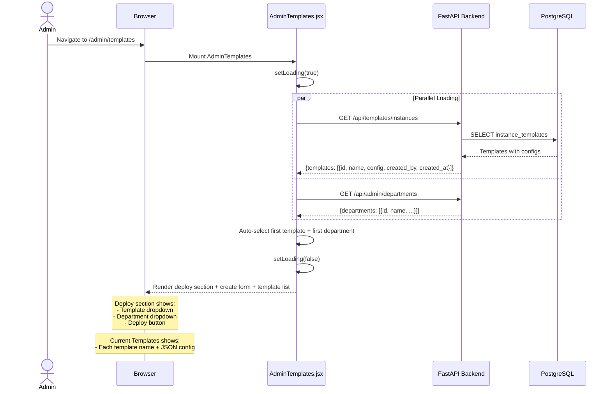
```mermaid
sequenceDiagram
    actor A as Admin
    participant BR as Browser
    participant React as AdminTemplates.jsx
    participant BE as FastAPI Backend
    participant DB as PostgreSQL

    A->>BR: Navigate to /admin/templates
    BR->>React: Mount AdminTemplates
    React->>React: setLoading(true)

    par Parallel Loading
        React->>BE: GET /api/templates/instances
        BE->>DB: SELECT instance_templates
        DB-->>BE: Templates with configs
        BE-->>React: {templates: [{id, name, config, created_by, created_at}]}
    and
        React->>BE: GET /api/admin/departments
        BE-->>React: {departments: [{id, name, ...}]}
    end

    React->>React: Auto-select first template + first department
    React->>React: setLoading(false)
    React-->>BR: Render deploy section + create form + template list

    Note over BR: Deploy section shows:<br/>- Template dropdown<br/>- Department dropdown<br/>- Deploy button

    Note over BR: Current Templates shows:<br/>- Each template name + JSON config
```

### 5.2 Create Instance Template

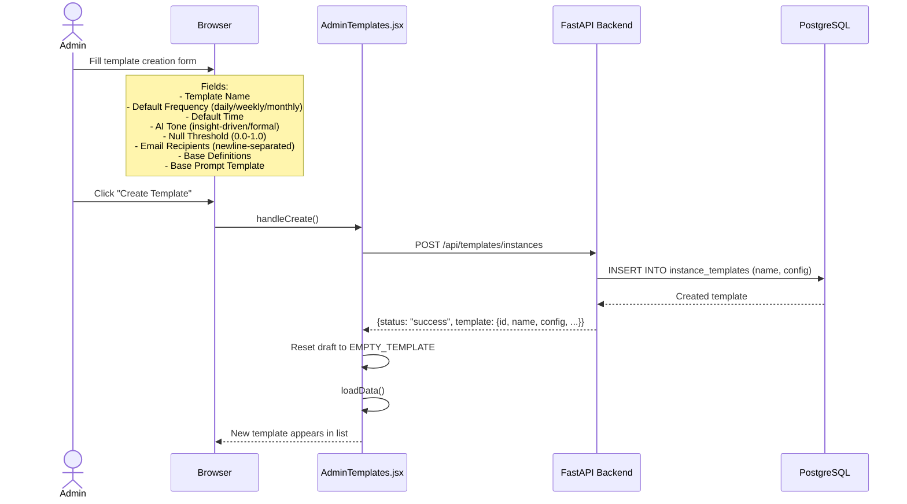
```mermaid
sequenceDiagram
    actor A as Admin
    participant BR as Browser
    participant React as AdminTemplates.jsx
    participant BE as FastAPI Backend
    participant DB as PostgreSQL

    A->>BR: Fill template creation form
    Note over BR: Fields:<br/>- Template Name<br/>- Default Frequency (daily/weekly/monthly)<br/>- Default Time<br/>- AI Tone (insight-driven/formal)<br/>- Null Threshold (0.0-1.0)<br/>- Email Recipients (newline-separated)<br/>- Base Definitions<br/>- Base Prompt Template

    A->>BR: Click "Create Template"
    BR->>React: handleCreate()
    React->>BE: POST /api/templates/instances
    BE->>DB: INSERT INTO instance_templates (name, config)
    DB-->>BE: Created template
    BE-->>React: {status: "success", template: {id, name, config, ...}}
    React->>React: Reset draft to EMPTY_TEMPLATE
    React->>React: loadData()
    React-->>BR: New template appears in list
```

### 5.3 Deploy Template to Department

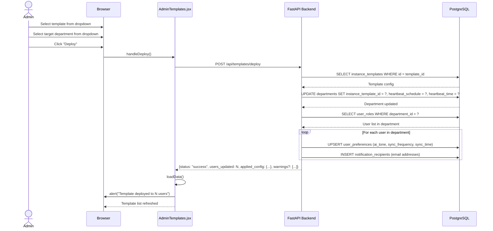
```mermaid
sequenceDiagram
    actor A as Admin
    participant BR as Browser
    participant React as AdminTemplates.jsx
    participant BE as FastAPI Backend
    participant DB as PostgreSQL

    A->>BR: Select template from dropdown
    A->>BR: Select target department from dropdown
    A->>BR: Click "Deploy"
    BR->>React: handleDeploy()
    React->>BE: POST /api/templates/deploy
    BE->>DB: SELECT instance_templates WHERE id = template_id
    DB-->>BE: Template config
    BE->>DB: UPDATE departments SET instance_template_id = ?, heartbeat_schedule = ?, heartbeat_time = ?
    DB-->>BE: Department updated
    BE->>DB: SELECT user_roles WHERE department_id = ?
    DB-->>BE: User list in department

    loop For each user in department
        BE->>DB: UPSERT user_preferences (ai_tone, sync_frequency, sync_time)
        BE->>DB: INSERT notification_recipients (email addresses)
    end

    BE-->>React: {status: "success", users_updated: N, applied_config: {...}, warnings?: [...]}
    React->>React: loadData()
    React->>BR: alert("Template deployed to N users")
    React-->>BR: Template list refreshed
```

---

## 6. Data Quality & Validation Audit

### 6.1 Validation Audit Page Load

```mermaid
sequenceDiagram
    actor A as Admin
    participant BR as Browser
    participant React as AdminValidation.jsx
    participant BE as FastAPI Backend
    participant DB as PostgreSQL

    A->>BR: Navigate to /admin/validation
    BR->>React: Mount AdminValidation
    React->>React: setLoading(true)

    par 4 Parallel API Calls
        React->>BE: GET /api/admin/validation/scorecard
        BE->>DB: Per-department validation log analysis
        BE-->>React: {scorecard: [{department_id, department_name, score, checks, last_validation}]}
    and
        React->>BE: GET /api/admin/validation/logs?limit=100
        BE->>DB: SELECT validation_logs (JOIN departments) ORDER BY created_at DESC LIMIT 100
        BE-->>React: {logs: [{id, department_id, department_name, check_type, status, message, created_at}]}
    and
        React->>BE: GET /api/data-quality/score
        BE->>DB: Query kpi_results for 4 quality dimensions
        Note over BE: Completeness (25pts): null field ratio<br/>Freshness (25pts): days since last update<br/>Validity (25pts): float-parseable values<br/>Consistency (25pts): unique KPI names ratio
        BE-->>React: {score, grade, checks: [...], recommendations: [...]}
    and
        React->>BE: GET /api/data-quality/issues
        BE->>DB: Detect missing_values, duplicates (same kpi+time), outliers (z>3)
        BE-->>React: {issue_count, issues: [{type, field, record_id, severity, message}]}
    end

    React->>React: setLoading(false)
    React-->>BR: Render 4-section page

    Note over BR: Sections:<br/>1. Data Quality Center (score + checks + recs)<br/>2. Quality Scorecard (per-department)<br/>3. Issues Table<br/>4. Audit Log (filterable)
```

### 6.2 Quality Score Computation (Backend Detail)

```
┌───────────────────────────────────────────────────────────────────┐
│                    DATA QUALITY SCORING                            │
├───────────────┬───────────────────────────────────────────────────┤
│ Dimension     │ Algorithm                                         │
├───────────────┼───────────────────────────────────────────────────┤
│ Completeness  │ (total_fields - null_fields) / total_fields × 25 │
│ (25 pts)      │ Pass ≥ 90%, Warn ≥ 70%, Fail < 70%              │
├───────────────┼───────────────────────────────────────────────────┤
│ Freshness     │ max(0, 100 - days_since_last × 5) / 100 × 25    │
│ (25 pts)      │ Pass ≥ 80%, Warn ≥ 50%, Fail < 50%              │
├───────────────┼───────────────────────────────────────────────────┤
│ Validity      │ parseable_float_count / total_count × 25         │
│ (25 pts)      │ Pass ≥ 95%, Warn ≥ 80%, Fail < 80%              │
├───────────────┼───────────────────────────────────────────────────┤
│ Consistency   │ unique_kpi_names / total_kpi_names × 25          │
│ (25 pts)      │ Pass ≥ 95%, Warn ≥ 80%, Fail < 80%              │
├───────────────┼───────────────────────────────────────────────────┤
│ Grade         │ A ≥ 90, B ≥ 80, C ≥ 70, D ≥ 60, F < 60          │
└───────────────┴───────────────────────────────────────────────────┘
```

### 6.3 Audit Log Filtering

```mermaid
sequenceDiagram
    actor A as Admin
    participant BR as Browser
    participant React as AdminValidation.jsx

    Note over React: All data loaded on mount (no re-fetch)
    Note over React: filtering is client-side only

    A->>BR: Select filter type dropdown
    alt All (empty filter)
        BR->>React: setFilterType('')
        React->>React: filteredLogs = logs
    else Schema checks only
        BR->>React: setFilterType('schema')
        React->>React: filteredLogs = logs.filter(l => l.check_type === 'schema')
    else Null checks only
        BR->>React: setFilterType('null')
        React->>React: filteredLogs = logs.filter(l => l.check_type === 'null')
    else Anomaly checks only
        BR->>React: setFilterType('anomaly')
        React->>React: filteredLogs = logs.filter(l => l.check_type === 'anomaly')
    end
    React-->>BR: Render filtered audit log table
```

---

## 7. Cross-Feature Workflows

### 7.1 New Department Onboarding Workflow

```mermaid
sequenceDiagram
    actor A as Admin
    participant React as Admin Pages
    participant BE as FastAPI Backend
    participant DB as PostgreSQL

    Note over A,DB: Complete onboarding workflow

    A->>React: 1. Create Semantic Template (/admin/semantic)
    React->>BE: POST /api/admin/semantic/templates
    BE->>DB: INSERT semantic_templates
    React->>BE: POST /api/admin/semantic/templates/{id}/fields
    BE->>DB: INSERT semantic_fields (multiple)
    Note over React: Template with field definitions created

    A->>React: 2. Create Instance Template (/admin/templates)
    React->>BE: POST /api/templates/instances
    BE->>DB: INSERT instance_templates
    Note over React: Config template with AI tone, sync schedule created

    A->>React: 3. Create Department (/admin/departments)
    React->>BE: POST /api/admin/departments
    BE->>DB: INSERT departments
    Note over React: Department created

    A->>React: 4. Assign Semantic Template (/admin/departments)
    React->>BE: PUT /api/admin/departments/{deptId}
    BE->>DB: UPDATE departments SET template_id = ?
    Note over React: Department mapped to semantic template

    A->>React: 5. Deploy Instance Template (/admin/templates)
    React->>BE: POST /api/templates/deploy
    BE->>DB: UPDATE departments + UPSERT user_preferences + INSERT notification_recipients
    Note over React: All users in department configured

    A->>React: 6. Assign Users (/admin/users)
    React->>BE: POST /api/admin/users/{userId}/role
    BE->>DB: INSERT user_roles (role=manager, department_id=deptId)
    Note over React: Users assigned to department with roles

    A->>React: 7. Trigger First ETL (/admin/departments)
    React->>BE: POST /api/admin/heartbeat/trigger/{deptId}
    BE->>DB: Fan out ETL pipelines per user
    Note over React: Data starts flowing
```

### 7.2 Full System Health Check Workflow

```mermaid
sequenceDiagram
    actor A as Admin
    participant React as Admin Pages
    participant BE as FastAPI Backend
    participant DB as PostgreSQL

    Note over A,DB: Admin checks entire system health

    A->>React: 1. View Admin Dashboard (/admin)
    React->>BE: GET /api/admin/summary
    BE-->>React: Department overview + combined KPIs
    Note over React: Check: all departments have data?

    A->>React: 2. Check Validation Scorecard
    React->>BE: GET /api/admin/validation/scorecard
    BE-->>React: Per-department quality scores
    Note over React: Check: any department below 70%?

    A->>React: 3. View Data Quality (/admin/validation)
    React->>BE: GET /api/data-quality/score
    BE-->>React: Overall grade + dimension breakdowns
    Note over React: Check: any dimension below threshold?

    A->>React: 4. Check Issues
    React->>BE: GET /api/data-quality/issues
    BE-->>React: Missing values, duplicates, outliers
    Note over React: Check: critical outliers exist?

    A->>React: 5. Review Audit Log
    React->>BE: GET /api/admin/validation/logs
    BE-->>React: Recent validation events
    Note over React: Check: any FAIL statuses?

    A->>React: 6. Check Users (/admin/users)
    React->>BE: GET /api/admin/users
    BE-->>React: All users with roles
    Note over React: Check: any users without roles?

    A->>React: 7. If issues found → Trigger Sync
    React->>BE: POST /api/etl/trigger
    BE-->>React: Sync started
    Note over React: Wait 3s, re-check scorecard
```

### 7.3 User Provisioning Workflow

```mermaid
sequenceDiagram
    actor A as Admin
    participant React as AdminUsers.jsx
    participant BE as FastAPI Backend
    participant DB as PostgreSQL
    participant SB as Supabase Auth
    participant Email as Brevo Email

    Note over A,Email: New user signs up → admin provisions them

    SB->>Email: User confirms email
    SB->>DB: INSERT INTO auth.users
    Note over DB: New user exists but has no role

    A->>React: Refresh /admin/users
    React->>BE: GET /api/admin/users
    BE->>SB: admin.list_users()
    SB-->>BE: Auth user list (includes new user)
    BE->>DB: SELECT user_roles
    BE->>BE: Merge: new user shows with no role
    BE-->>React: User list (new user highlighted)
    React-->>BR: New user row with "Assign Role" button

    A->>React: Click "Assign Role" for new user
    A->>React: Select role: "manager"
    A->>React: Select department: "Claims"
    A->>React: Click "Save"
    React->>BE: POST /api/admin/users/{userId}/role
    BE->>DB: INSERT INTO user_roles (user_id, role='manager', department_id='claims')
    DB-->>BE: Saved
    BE-->>React: {status: "success"}
    React->>React: fetchUsers()
    React-->>BR: User now shows "manager" badge + "Claims" department

    Note over A,Email: If instance template deployed to Claims dept,
    Note over A,Email: user automatically gets configured preferences
```

---

## 8. Admin Offline Mode

### 8.1 Admin Page Offline Behavior Matrix

```
┌─────────────────────────┬──────────────┬───────────────────────────────────────┐
│ Admin Page              │ Cache Key    │ Offline Behavior                      │
├─────────────────────────┼──────────────┼───────────────────────────────────────┤
│ Admin Dashboard         │ (none)       │ Show "Offline: cannot load admin      │
│ /admin                  │              │ overview" - requires live data        │
├─────────────────────────┼──────────────┼───────────────────────────────────────┤
│ Departments             │ (none)       │ Show "Offline: cannot manage          │
│ /admin/departments      │              │ departments" - mutations need online  │
├─────────────────────────┼──────────────┼───────────────────────────────────────┤
│ Users & Roles           │ (none)       │ Show "Offline: cannot manage users"   │
│ /admin/users            │              │ - role changes need backend           │
├─────────────────────────┼──────────────┼───────────────────────────────────────┤
│ Semantic Templates      │ (none)       │ Show "Offline: cannot manage          │
│ /admin/semantic         │              │ templates" - CRUD needs backend       │
├─────────────────────────┼──────────────┼───────────────────────────────────────┤
│ Instance Templates      │ (none)       │ Show "Offline: cannot deploy          │
│ /admin/templates        │              │ templates" - deploy needs backend     │
├─────────────────────────┼──────────────┼───────────────────────────────────────┤
│ Data Quality Audit      │ (none)       │ Show "Offline: cannot load audit"     │
│ /admin/validation       │              │ - requires live quality scoring       │
└─────────────────────────┴──────────────┴───────────────────────────────────────┘

NOTE: Admin features are write-heavy and data-critical.
      Offline mode should be READ-ONLY where possible,
      with clear indicators that changes cannot be saved.
```

### 8.2 Recommended Admin Offline Strategy

```mermaid
sequenceDiagram
    actor A as Admin
    participant BR as Browser
    participant React as Admin Page
    participant Cache as localStorage
    participant BE as FastAPI Backend
    participant Banner as OfflineBanner

    Note over A,Banner: Admin offline strategy is DIFFERENT from manager
    Note over A,Banner: Admin pages require live data for mutations
    Note over A,Banner: But can cache READ-ONLY views for reference

    alt Online
        React->>Banner: online = true
        Banner-->>BR: No banner
        React->>Cache: Cache current admin summary
        React->>BE: All operations work normally
    else Offline
        React->>Banner: online = true → false
        Banner-->>BR: Show "Admin mode: read-only (changes cannot be saved)"
        React->>Cache: Load cached admin summary (if available)

        alt Read-Only View (Dashboard)
            Cache-->>React: Cached department overview
            React-->>BR: Show cached data with "STALE" badge
            Note over BR: All mutation buttons disabled<br/>Sync, Create, Delete grayed out
        else Mutation Attempted
            A->>BR: Click "Create Department" while offline
            React->>React: Check navigator.onLine
            React-->>BR: Alert: "Cannot create department while offline"
            Note over BR: Prevent the mutation entirely
        end
    end
```

### 8.3 Admin Action Queue (Proposed for Future)

```mermaid
sequenceDiagram
    actor A as Admin
    participant React as Admin Page
    participant IDB as IndexedDB
    participant BE as FastAPI Backend

    Note over A,IDB: PROPOSED: Queue admin mutations for later sync

    A->>React: Assign role to user (while offline)
    React->>React: Check navigator.onLine
    React->>IDB: Queue: {type: "assign_role", userId, role, departmentId, timestamp}
    React-->>A: "Action queued. Will sync when online."

    A->>React: Create department (while offline)
    React->>IDB: Queue: {type: "create_department", name, description, ...}
    React-->>A: "Action queued."

    Note over React: Network restored
    React->>React: navigator.onLine = true
    React->>IDB: Drain queue

    loop For each queued action
        alt Action: assign_role
            React->>BE: POST /api/admin/users/{userId}/role
            BE-->>React: Success
            React->>IDB: Remove from queue
        else Action: create_department
            React->>BE: POST /api/admin/departments
            BE-->>React: Success
            React->>IDB: Remove from queue
        else Action: delete_department
            React->>BE: DELETE /api/admin/departments/{id}
            BE-->>React: Success
            React->>IDB: Remove from queue
        end
    end

    React-->>A: "3 queued admin actions synced successfully"
    Note over A: IMPORTANT: Conflict resolution needed<br/>for concurrent admin edits
```

---

## Complete Admin Flow Map

```
┌──────────────────────────────────────────────────────────────────────┐
│                         ADMIN FLOW MAP                               │
├──────────────────────────────────────────────────────────────────────┤
│                                                                      │
│  Admin Login (same as manager, but role = admin)                     │
│    │                                                                 │
│    ▼                                                                 │
│  ┌──────────────────────────────────────────────────┐                │
│  │              ADMIN DASHBOARD (/admin)              │                │
│  │                                                    │                │
│  │  ┌─────────────┐  ┌──────────────┐  ┌──────────┐ │                │
│  │  │ Dept Overview│  │ Combined KPIs│  │ Timeline │ │                │
│  │  │  (cards)     │  │  (bar chart) │  │ (drill)  │ │                │
│  │  └──────┬──────┘  └──────┬───────┘  └────┬─────┘ │                │
│  │         │                │               │         │                │
│  │    ┌────┴────┐    ┌─────┴──────┐   ┌───┴──────┐  │                │
│  │    │Expand   │    │Combined    │   │Bar Click │  │                │
│  │    │Details  │    │Report Load │   │Drill-down│  │                │
│  │    └────┬────┘    └────────────┘   └──────────┘  │                │
│  │         │                                          │                │
│  │    ┌────┴────┐  ┌──────────────┐  ┌──────────┐   │                │
│  │    │KPI Click│  │ Quality      │  │ Sync Now │   │                │
│  │    │Lineage  │  │ Scorecard    │  │ (ETL)    │   │                │
│  │    └─────────┘  └──────────────┘  └──────────┘   │                │
│  └──────────────────────────────────────────────────┘                │
│                                                                      │
│  ┌──────────────────────────────────────────────────┐                │
│  │           SIDEBAR NAVIGATION (admin)              │                │
│  │                                                    │                │
│  │  ┌──────────────────┐  ┌───────────────────┐      │                │
│  │  │ Departments       │  │ Users & Roles      │      │                │
│  │  │ CRUD              │  │ Assign/Remove      │      │                │
│  │  │ Assign Template   │  │ Role dropdowns     │      │                │
│  │  │ Trigger ETL       │  │ Department select  │      │                │
│  │  └──────────────────┘  └───────────────────┘      │                │
│  │                                                    │                │
│  │  ┌──────────────────┐  ┌───────────────────┐      │                │
│  │  │ Semantic Templates│  │ Instance Templates │      │                │
│  │  │ Create/Delete     │  │ Create/Deploy      │      │                │
│  │  │ Field definitions │  │ Config settings    │      │                │
│  │  │ Type/Required     │  │ AI tone, schedule  │      │                │
│  │  └──────────────────┘  └───────────────────┘      │                │
│  │                                                    │                │
│  │  ┌──────────────────┐                              │                │
│  │  │ Data Quality      │                              │                │
│  │  │ Audit             │                              │                │
│  │  │ Score + Grade     │                              │                │
│  │  │ Issues table      │                              │                │
│  │  │ Audit log filter  │                              │                │
│  │  └──────────────────┘                              │                │
│  └──────────────────────────────────────────────────┘                │
│                                                                      │
│  ┌──────────────────────────────────────────────────┐                │
│  │         ADMIN OFFLINE STRATEGY                    │                │
│  │                                                    │                │
│  │  Read-only views: Cache for reference              │                │
│  │  Mutations: BLOCKED when offline                   │                │
│  │  Future: IndexedDB action queue + conflict res.    │                │
│  │  All admin pages require backend for integrity     │                │
│  └──────────────────────────────────────────────────┘                │
│                                                                      │
│  ┌──────────────────────────────────────────────────┐                │
│  │         CROSS-FEATURE WORKFLOWS                    │                │
│  │                                                    │                │
│  │  New Dept Onboarding (7 steps):                    │                │
│  │  Semantic Template → Instance Template →            │                │
│  │  Create Dept → Assign Semantic → Deploy Instance →  │                │
│  │  Assign Users → Trigger ETL                         │                │
│  │                                                    │                │
│  │  Health Check (7 steps):                            │                │
│  │  Dashboard → Scorecard → Quality → Issues →         │                │
│  │  Audit Log → Users → Sync if needed                 │                │
│  │                                                    │                │
│  │  User Provisioning (4 steps):                       │                │
│  │  User signs up → Admin sees in list →               │                │
│  │  Assign role + dept → Auto-configured               │                │
│  └──────────────────────────────────────────────────┘                │
│                                                                      │
└──────────────────────────────────────────────────────────────────────┘
```

---

*Generated for CNPS Smart Automated Analytics System - Admin Side Flow Analysis*
*Date: July 2026*
