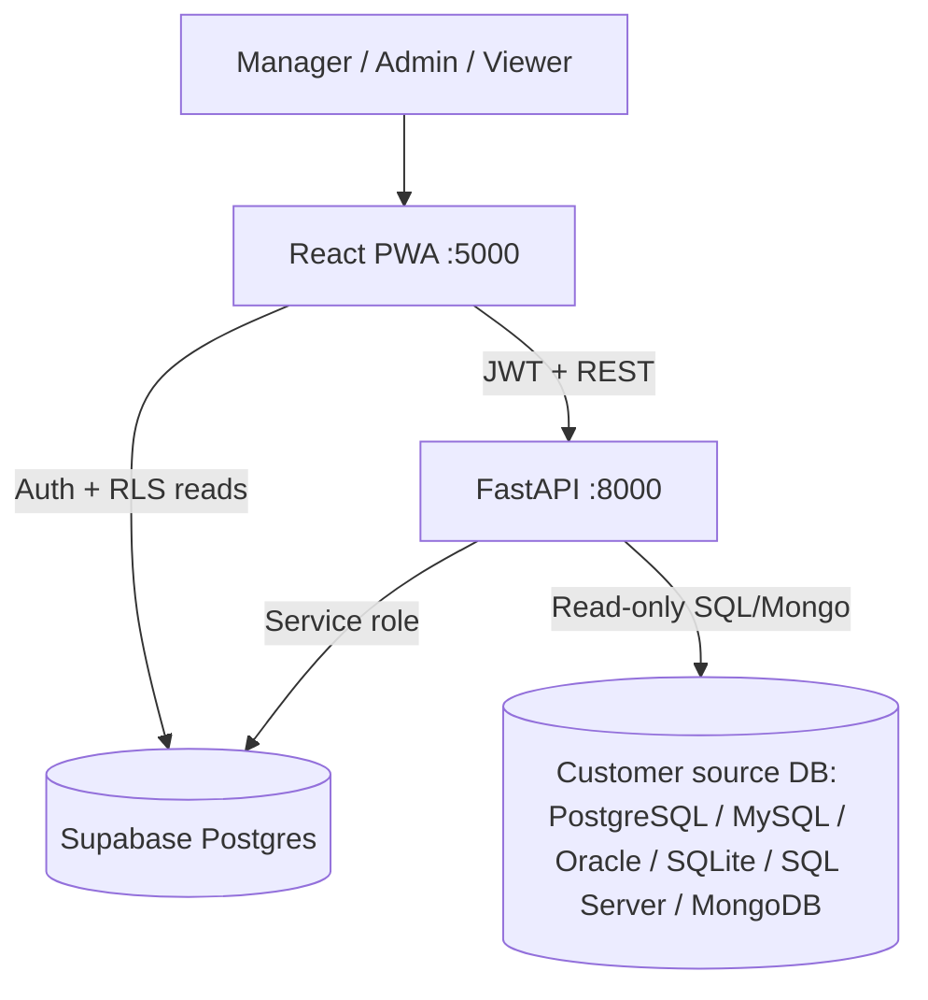
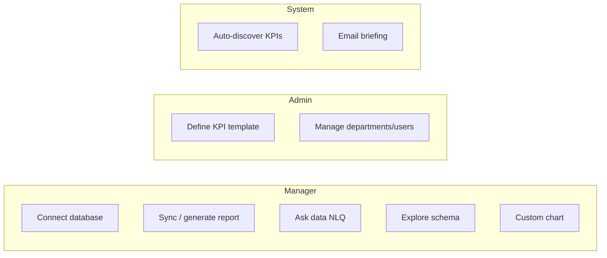
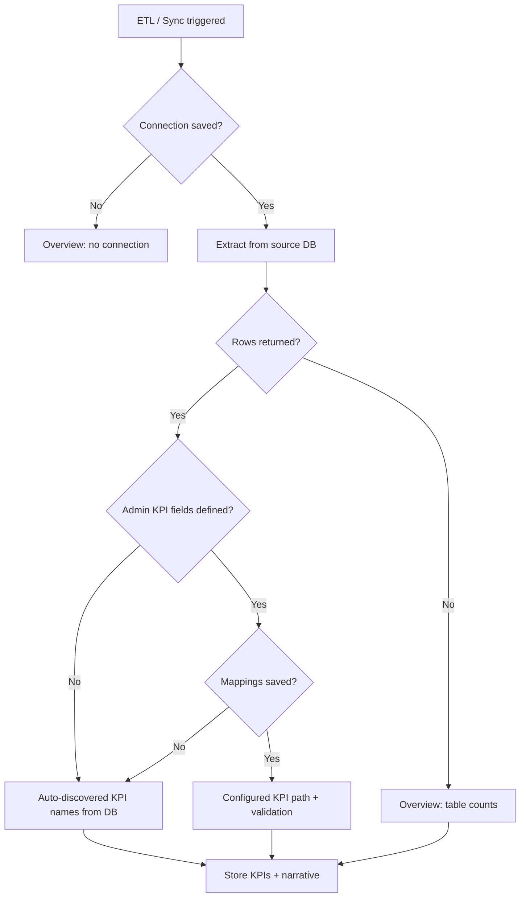
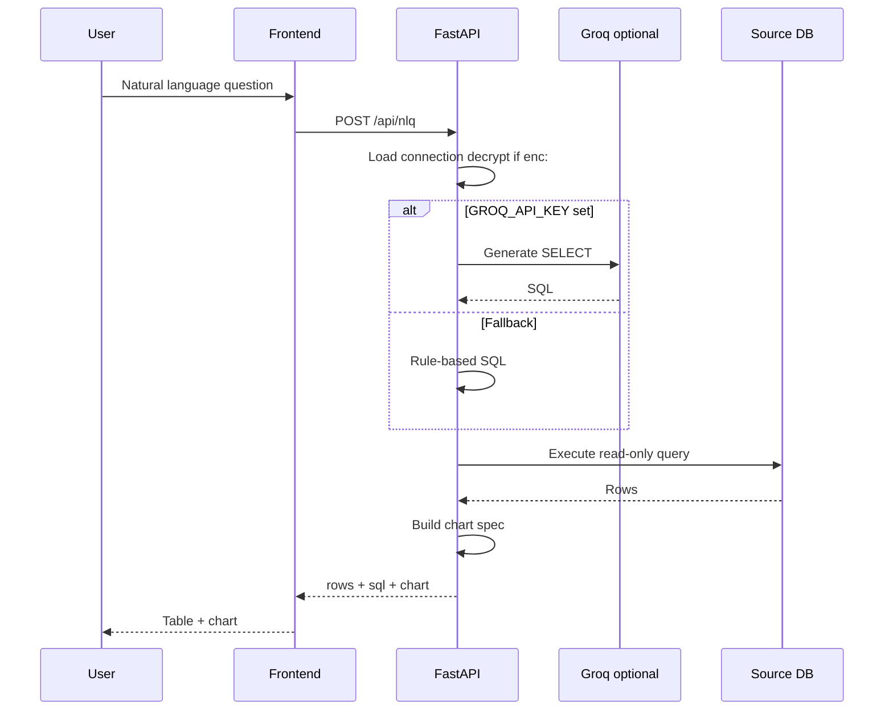
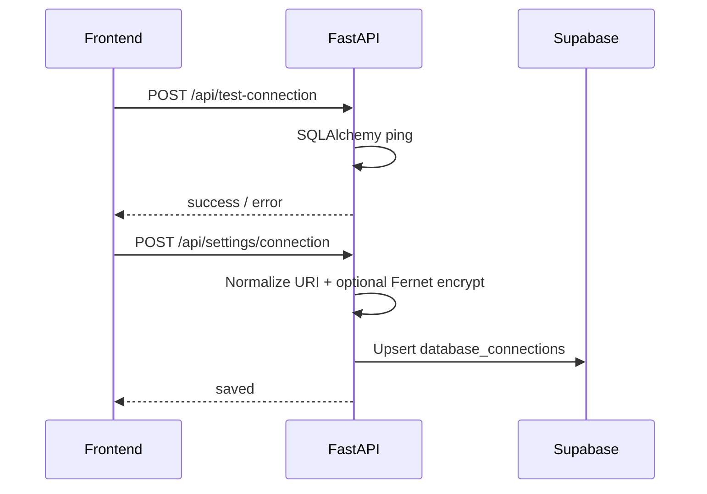
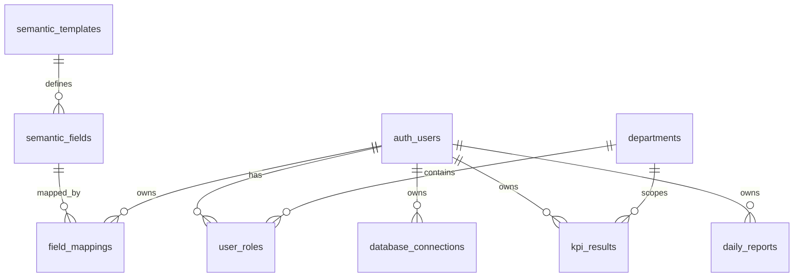
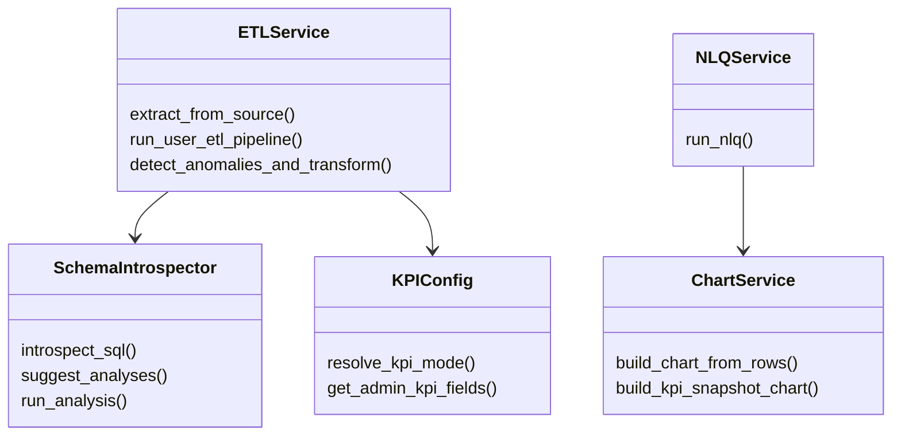

# SAAS architecture & UML diagrams

## System context

## Use cases

## KPI decision activity

## Sequence: Ask your data (NLQ)

## Sequence: Save connection

## ER diagram (app database)

## Service classes (backend)

