# Manager Side - Detailed Sequence Diagrams
## CNPS Smart Automated Analytics System

---

## Table of Contents

1. [Authentication Flow](#1-authentication-flow)
2. [Dashboard Flow](#2-dashboard-flow)
3. [AI Analyst Flow](#3-ai-analyst-flow)
4. [Analysis Focus (Goal-Driven)](#4-analysis-focus-goal-driven)
5. [Ask Your Data (NLQ)](#5-ask-your-data-nlq)
6. [Validation History Flow](#6-validation-history-flow)
7. [Schema Explorer Flow](#7-schema-explorer-flow)
8. [Custom Report Flow](#8-custom-report-flow)
9. [Settings Flow](#9-settings-flow)
10. [Offline Mode Architecture](#10-offline-mode-architecture)
11. [Service Worker Lifecycle](#11-service-worker-lifecycle)

---

## 1. Authentication Flow

### 1.1 App Launch → Login Screen

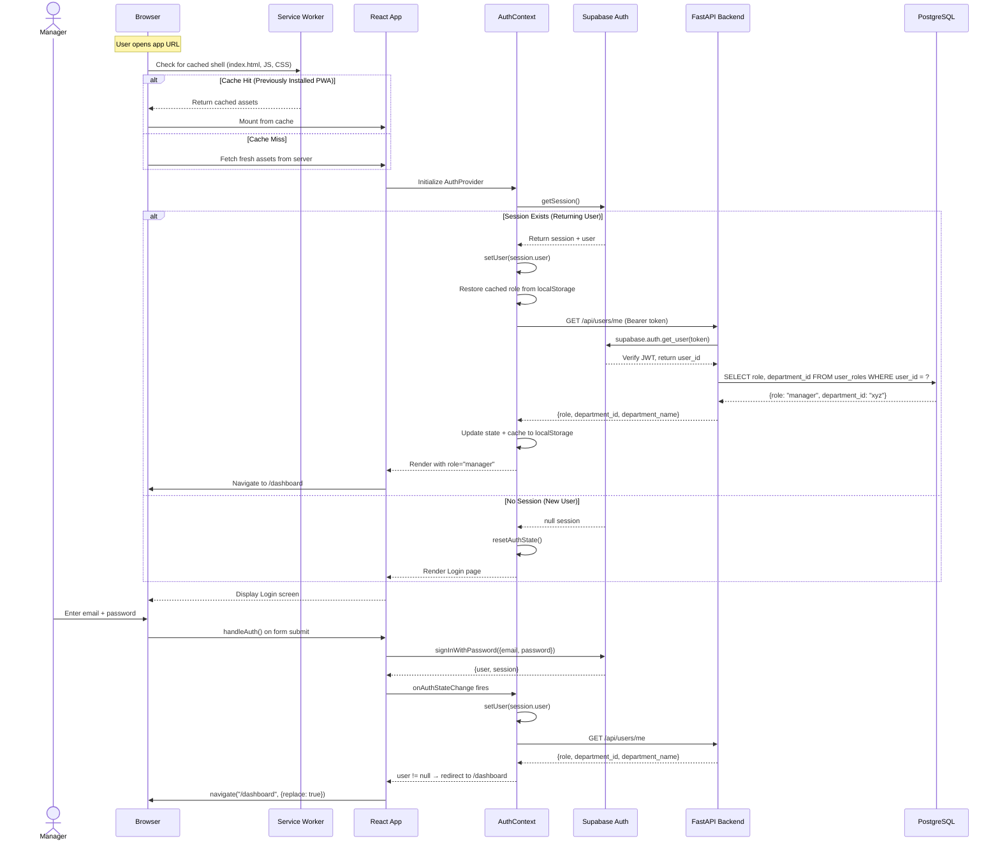
```mermaid
sequenceDiagram
    actor M as Manager
    participant BR as Browser
    participant SW as Service Worker
    participant React as React App
    participant AuthCtx as AuthContext
    participant SB as Supabase Auth
    participant BE as FastAPI Backend
    participant DB as PostgreSQL

    Note over BR: User opens app URL
    BR->>SW: Check for cached shell (index.html, JS, CSS)
    alt Cache Hit (Previously Installed PWA)
        SW-->>BR: Return cached assets
        BR->>React: Mount from cache
    else Cache Miss
        BR->>React: Fetch fresh assets from server
    end

    React->>AuthCtx: Initialize AuthProvider
    AuthCtx->>SB: getSession()
    alt Session Exists (Returning User)
        SB-->>AuthCtx: Return session + user
        AuthCtx->>AuthCtx: setUser(session.user)
        AuthCtx->>AuthCtx: Restore cached role from localStorage
        AuthCtx->>BE: GET /api/users/me (Bearer token)
        BE->>SB: supabase.auth.get_user(token)
        SB-->>BE: Verify JWT, return user_id
        BE->>DB: SELECT role, department_id FROM user_roles WHERE user_id = ?
        DB-->>BE: {role: "manager", department_id: "xyz"}
        BE-->>AuthCtx: {role, department_id, department_name}
        AuthCtx->>AuthCtx: Update state + cache to localStorage
        AuthCtx-->>React: Render with role="manager"
        React->>BR: Navigate to /dashboard
    else No Session (New User)
        SB-->>AuthCtx: null session
        AuthCtx->>AuthCtx: resetAuthState()
        AuthCtx-->>React: Render Login page
    end

    React-->>BR: Display Login screen
    M->>BR: Enter email + password
    BR->>React: handleAuth() on form submit
    React->>SB: signInWithPassword({email, password})
    SB-->>React: {user, session}
    React->>AuthCtx: onAuthStateChange fires
    AuthCtx->>AuthCtx: setUser(session.user)
    AuthCtx->>BE: GET /api/users/me
    BE-->>AuthCtx: {role, department_id, department_name}
    AuthCtx-->>React: user != null → redirect to /dashboard
    React->>BR: navigate("/dashboard", {replace: true})
```

### 1.2 Sign-Up Flow

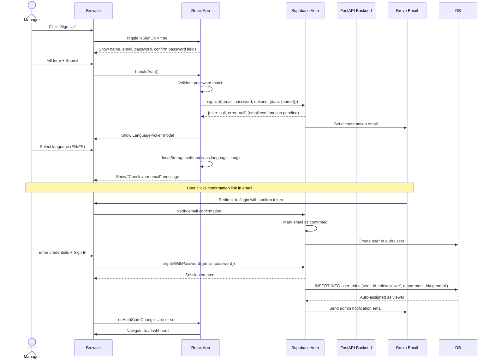
```mermaid
sequenceDiagram
    actor M as Manager
    participant BR as Browser
    participant React as React App
    participant SB as Supabase Auth
    participant BE as FastAPI Backend
    participant Email as Brevo Email

    M->>BR: Click "Sign Up"
    BR->>React: Toggle isSignUp = true
    React-->>BR: Show name, email, password, confirm password fields
    M->>BR: Fill form + Submit
    BR->>React: handleAuth()
    React->>React: Validate password match
    React->>SB: signUp({email, password, options: {data: {name}}})
    SB-->>React: {user: null, error: null} (email confirmation pending)
    SB->>Email: Send confirmation email
    React-->>BR: Show LanguagePicker modal
    M->>BR: Select language (EN/FR)
    React->>React: localStorage.setItem('saas.language', lang)
    React-->>BR: Show "Check your email" message

    Note over M,Email: User clicks confirmation link in email
    Email->>BR: Redirect to /login with confirm token
    BR->>SB: Verify email confirmation
    SB->>SB: Mark email as confirmed
    SB->>DB: Create user in auth.users
    M->>BR: Enter credentials + Sign In
    BR->>SB: signInWithPassword({email, password})
    SB-->>BR: Session created
    SB->>DB: INSERT INTO user_roles (user_id, role='viewer', department_id='general')
    DB-->>SB: Auto-assigned as viewer
    SB->>Email: Send admin notification email
    BR->>React: onAuthStateChange → user set
    React->>BR: Navigate to /dashboard
```

### 1.3 Password Reset Flow

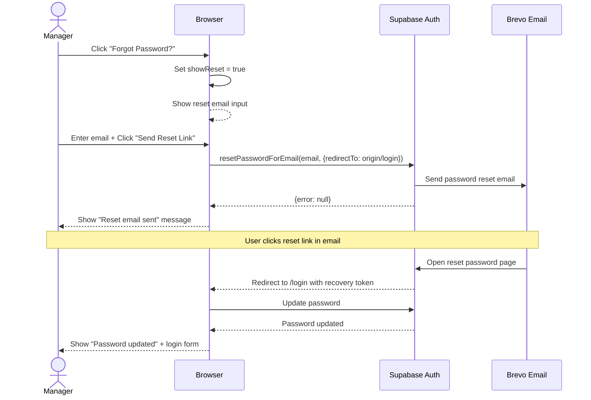
```mermaid
sequenceDiagram
    actor M as Manager
    participant BR as Browser
    participant SB as Supabase Auth
    participant Email as Brevo Email

    M->>BR: Click "Forgot Password?"
    BR->>BR: Set showReset = true
    BR-->>BR: Show reset email input
    M->>BR: Enter email + Click "Send Reset Link"
    BR->>SB: resetPasswordForEmail(email, {redirectTo: origin/login})
    SB->>Email: Send password reset email
    SB-->>BR: {error: null}
    BR-->>M: Show "Reset email sent" message
    Note over M,Email: User clicks reset link in email
    Email->>SB: Open reset password page
    SB-->>BR: Redirect to /login with recovery token
    BR->>SB: Update password
    SB-->>BR: Password updated
    BR-->>M: Show "Password updated" + login form
```

### 1.4 Session Management & Inactivity Timeout

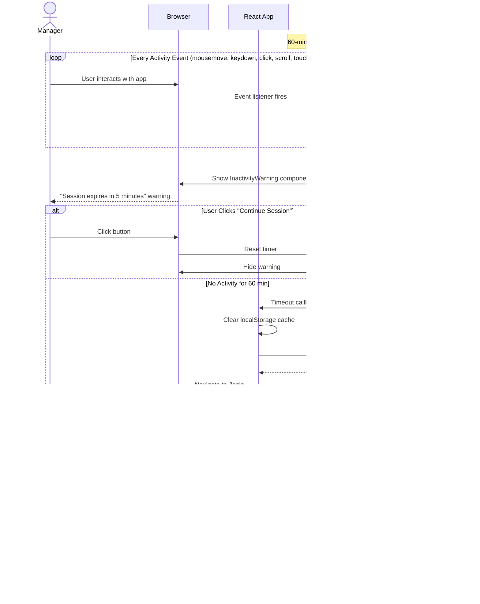
```mermaid
sequenceDiagram
    actor M as Manager
    participant BR as Browser
    participant React as React App
    participant Hook as useInactivityTimeout
    participant SB as Supabase Auth

    Note over Hook: 60-minute inactivity timer starts on login
    loop Every Activity Event (mousemove, keydown, click, scroll, touch)
        M->>BR: User interacts with app
        BR->>Hook: Event listener fires
        Hook->>Hook: Reset timer to 0
    end

    Note over Hook: 55 minutes of inactivity
    Hook->>BR: Show InactivityWarning component
    BR-->>M: "Session expires in 5 minutes" warning

    alt User Clicks "Continue Session"
        M->>BR: Click button
        BR->>Hook: Reset timer
        Hook->>BR: Hide warning
    else No Activity for 60 min
        Hook->>React: Timeout callback fires
        React->>React: Clear localStorage cache
        React->>SB: signOut()
        SB-->>React: Session destroyed
        React->>BR: Navigate to /login
        BR-->>M: Redirected to login
    end

    Note over React: Token refresh on API calls
    React->>React: apiFetch() gets session
    alt Token Expired
        React->>SB: refreshSession()
        SB-->>React: New access_token
        React->>React: Retry API call with new token
    end
```

---

## 2. Dashboard Flow

### 2.1 Dashboard Initial Load

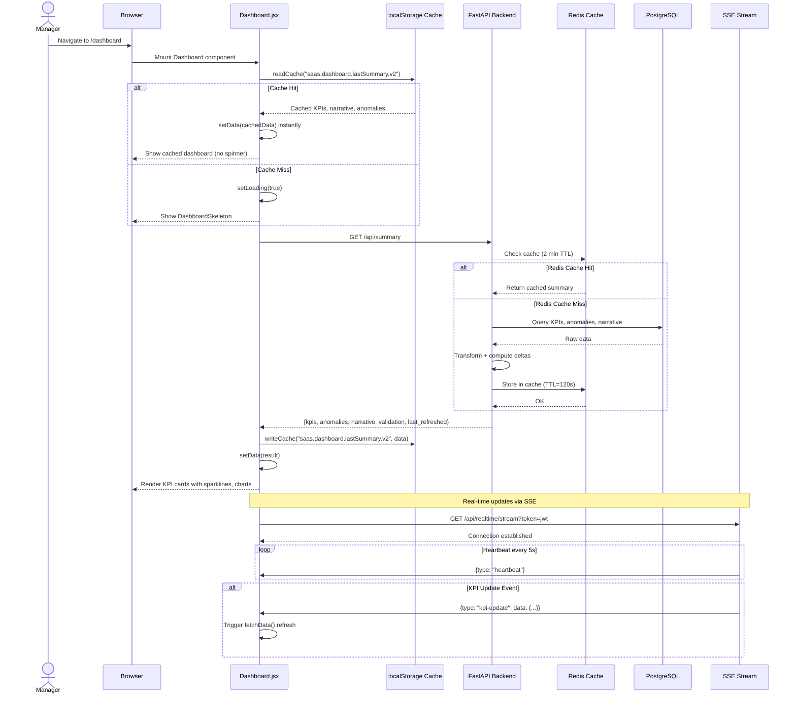
```mermaid
sequenceDiagram
    actor M as Manager
    participant BR as Browser
    participant React as Dashboard.jsx
    participant Cache as localStorage Cache
    participant BE as FastAPI Backend
    participant Redis as Redis Cache
    participant DB as PostgreSQL
    participant SSE as SSE Stream

    M->>BR: Navigate to /dashboard
    BR->>React: Mount Dashboard component
    React->>Cache: readCache("saas.dashboard.lastSummary.v2")
    alt Cache Hit
        Cache-->>React: Cached KPIs, narrative, anomalies
        React->>React: setData(cachedData) instantly
        React-->>BR: Show cached dashboard (no spinner)
    else Cache Miss
        React->>React: setLoading(true)
        React-->>BR: Show DashboardSkeleton
    end

    React->>BE: GET /api/summary
    BE->>Redis: Check cache (2 min TTL)
    alt Redis Cache Hit
        Redis-->>BE: Return cached summary
    else Redis Cache Miss
        BE->>DB: Query KPIs, anomalies, narrative
        DB-->>BE: Raw data
        BE->>BE: Transform + compute deltas
        BE->>Redis: Store in cache (TTL=120s)
        Redis-->>BE: OK
    end
    BE-->>React: {kpis, anomalies, narrative, validation, last_refreshed}
    React->>Cache: writeCache("saas.dashboard.lastSummary.v2", data)
    React->>React: setData(result)
    React-->>BR: Render KPI cards with sparklines, charts

    Note over React,SSE: Real-time updates via SSE
    React->>SSE: GET /api/realtime/stream?token=jwt
    SSE-->>React: Connection established
    loop Heartbeat every 5s
        SSE->>React: {type: "heartbeat"}
    end
    alt KPI Update Event
        SSE->>React: {type: "kpi-update", data: {...}}
        React->>React: Trigger fetchData() refresh
    end
```

### 2.2 Dashboard Tab Switching

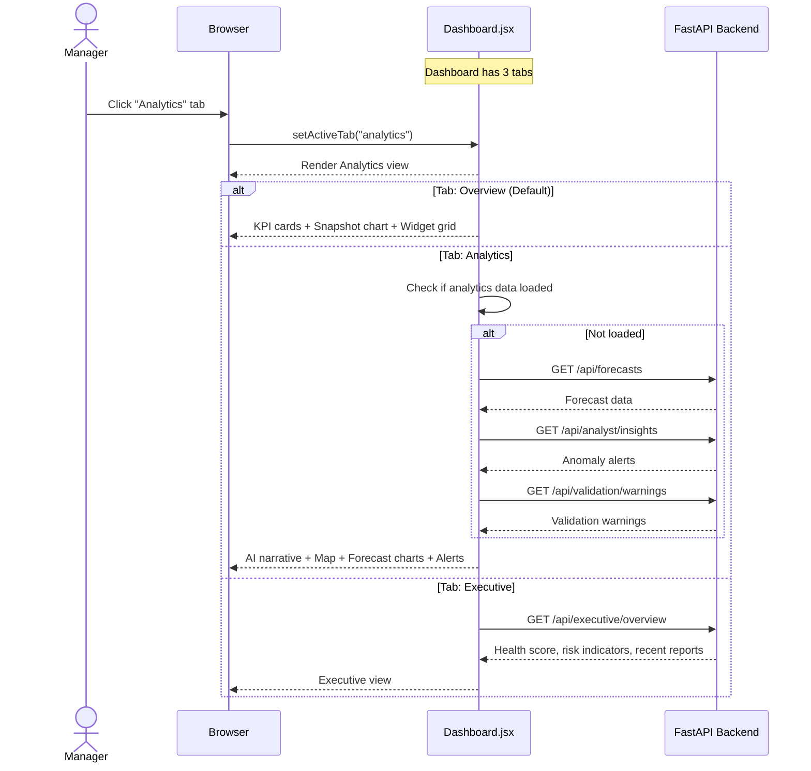
```mermaid
sequenceDiagram
    actor M as Manager
    participant BR as Browser
    participant React as Dashboard.jsx
    participant BE as FastAPI Backend

    Note over React: Dashboard has 3 tabs
    M->>BR: Click "Analytics" tab
    BR->>React: setActiveTab("analytics")
    React-->>BR: Render Analytics view

    alt Tab: Overview (Default)
        React-->>BR: KPI cards + Snapshot chart + Widget grid
    else Tab: Analytics
        React->>React: Check if analytics data loaded
        alt Not loaded
            React->>BE: GET /api/forecasts
            BE-->>React: Forecast data
            React->>BE: GET /api/analyst/insights
            BE-->>React: Anomaly alerts
            React->>BE: GET /api/validation/warnings
            BE-->>React: Validation warnings
        end
        React-->>BR: AI narrative + Map + Forecast charts + Alerts
    else Tab: Executive
        React->>BE: GET /api/executive/overview
        BE-->>React: Health score, risk indicators, recent reports
        React-->>BR: Executive view
    end
```

### 2.3 ETL Sync Flow (Dashboard)

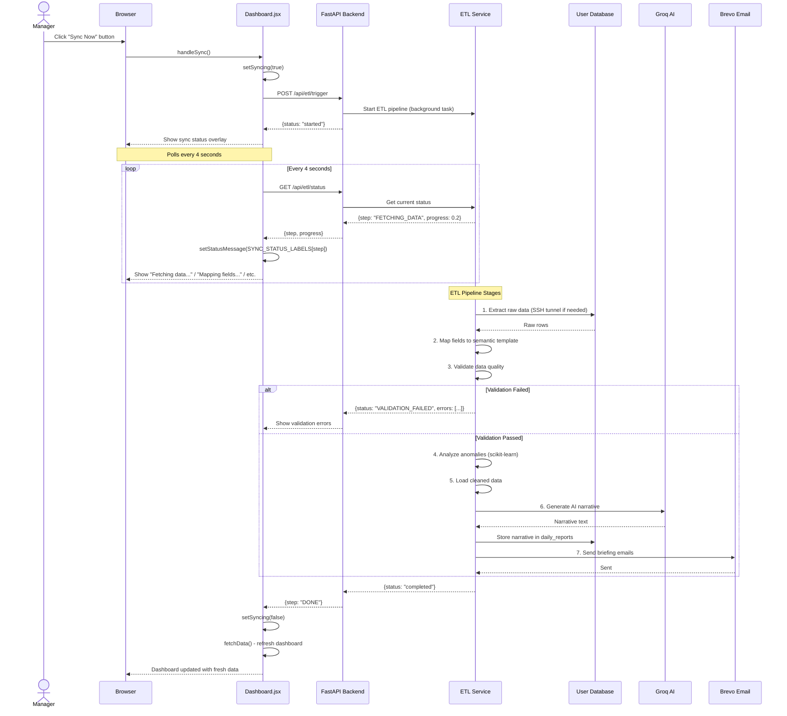
```mermaid
sequenceDiagram
    actor M as Manager
    participant BR as Browser
    participant React as Dashboard.jsx
    participant BE as FastAPI Backend
    participant ETL as ETL Service
    participant DB as User Database
    participant Groq as Groq AI
    participant Email as Brevo Email

    M->>BR: Click "Sync Now" button
    BR->>React: handleSync()
    React->>React: setSyncing(true)
    React->>BE: POST /api/etl/trigger
    BE->>ETL: Start ETL pipeline (background task)
    BE-->>React: {status: "started"}
    React-->>BR: Show sync status overlay

    Note over React,BR: Polls every 4 seconds
    loop Every 4 seconds
        React->>BE: GET /api/etl/status
        BE->>ETL: Get current status
        ETL-->>BE: {step: "FETCHING_DATA", progress: 0.2}
        BE-->>React: {step, progress}
        React->>React: setStatusMessage(SYNC_STATUS_LABELS[step])
        React-->>BR: Show "Fetching data..." / "Mapping fields..." / etc.
    end

    Note over ETL: ETL Pipeline Stages
    ETL->>DB: 1. Extract raw data (SSH tunnel if needed)
    DB-->>ETL: Raw rows
    ETL->>ETL: 2. Map fields to semantic template
    ETL->>ETL: 3. Validate data quality
    alt Validation Failed
        ETL-->>BE: {status: "VALIDATION_FAILED", errors: [...]}
        BE-->>React: Show validation errors
    else Validation Passed
        ETL->>ETL: 4. Analyze anomalies (scikit-learn)
        ETL->>ETL: 5. Load cleaned data
        ETL->>Groq: 6. Generate AI narrative
        Groq-->>ETL: Narrative text
        ETL->>DB: Store narrative in daily_reports
        ETL->>Email: 7. Send briefing emails
        Email-->>ETL: Sent
    end

    ETL-->>BE: {status: "completed"}
    BE-->>React: {step: "DONE"}
    React->>React: setSyncing(false)
    React->>React: fetchData() - refresh dashboard
    React-->>BR: Dashboard updated with fresh data
```

### 2.4 Report Generation Flow (Dashboard)

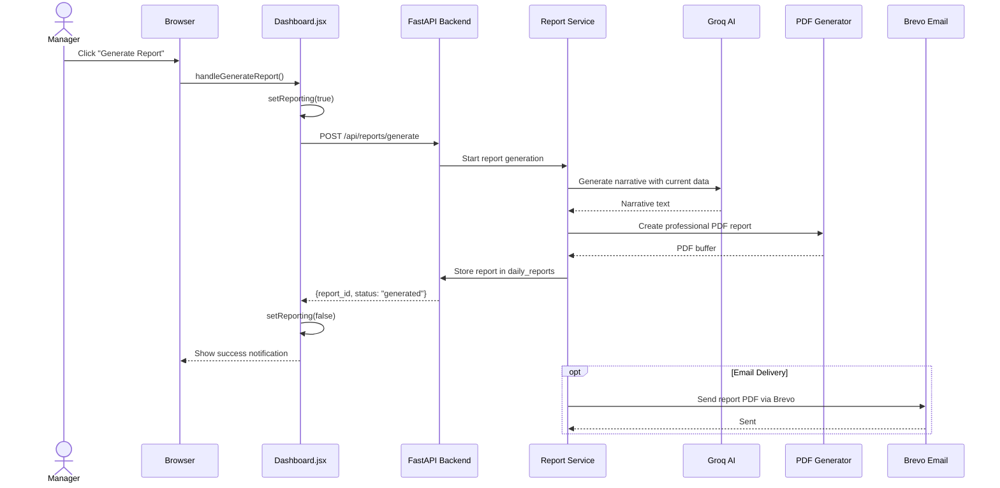
```mermaid
sequenceDiagram
    actor M as Manager
    participant BR as Browser
    participant React as Dashboard.jsx
    participant BE as FastAPI Backend
    participant Report as Report Service
    participant Groq as Groq AI
    participant PDF as PDF Generator
    participant Email as Brevo Email

    M->>BR: Click "Generate Report"
    BR->>React: handleGenerateReport()
    React->>React: setReporting(true)
    React->>BE: POST /api/reports/generate
    BE->>Report: Start report generation
    Report->>Groq: Generate narrative with current data
    Groq-->>Report: Narrative text
    Report->>PDF: Create professional PDF report
    PDF-->>Report: PDF buffer
    Report->>BE: Store report in daily_reports
    BE-->>React: {report_id, status: "generated"}
    React->>React: setReporting(false)
    React-->>BR: Show success notification

    opt Email Delivery
        Report->>Email: Send report PDF via Brevo
        Email-->>Report: Sent
    end
```

---

## 3. AI Analyst Flow

### 3.1 AI Analyst Page Load

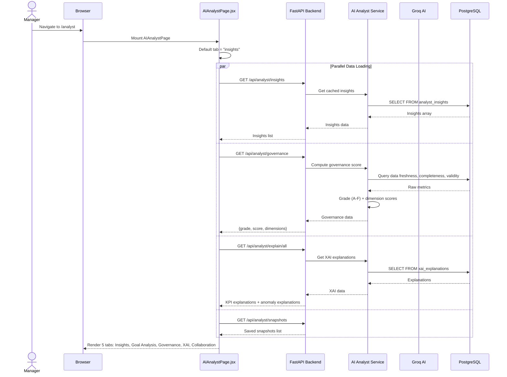
```mermaid
sequenceDiagram
    actor M as Manager
    participant BR as Browser
    participant React as AIAnalystPage.jsx
    participant BE as FastAPI Backend
    participant AI as AI Analyst Service
    participant Groq as Groq AI
    participant DB as PostgreSQL

    M->>BR: Navigate to /analyst
    BR->>React: Mount AIAnalystPage
    React->>React: Default tab = "insights"

    par Parallel Data Loading
        React->>BE: GET /api/analyst/insights
        BE->>AI: Get cached insights
        AI->>DB: SELECT FROM analyst_insights
        DB-->>AI: Insights array
        AI-->>BE: Insights data
        BE-->>React: Insights list
    and
        React->>BE: GET /api/analyst/governance
        BE->>AI: Compute governance score
        AI->>DB: Query data freshness, completeness, validity
        DB-->>AI: Raw metrics
        AI->>AI: Grade (A-F) + dimension scores
        AI-->>BE: Governance data
        BE-->>React: {grade, score, dimensions}
    and
        React->>BE: GET /api/analyst/explain/all
        BE->>AI: Get XAI explanations
        AI->>DB: SELECT FROM xai_explanations
        DB-->>AI: Explanations
        AI-->>BE: XAI data
        BE-->>React: KPI explanations + anomaly explanations
    and
        React->>BE: GET /api/analyst/snapshots
        BE-->>React: Saved snapshots list
    end

    React-->>BR: Render 5 tabs: Insights, Goal Analysis, Governance, XAI, Collaboration
```

### 3.2 Run Full Analysis

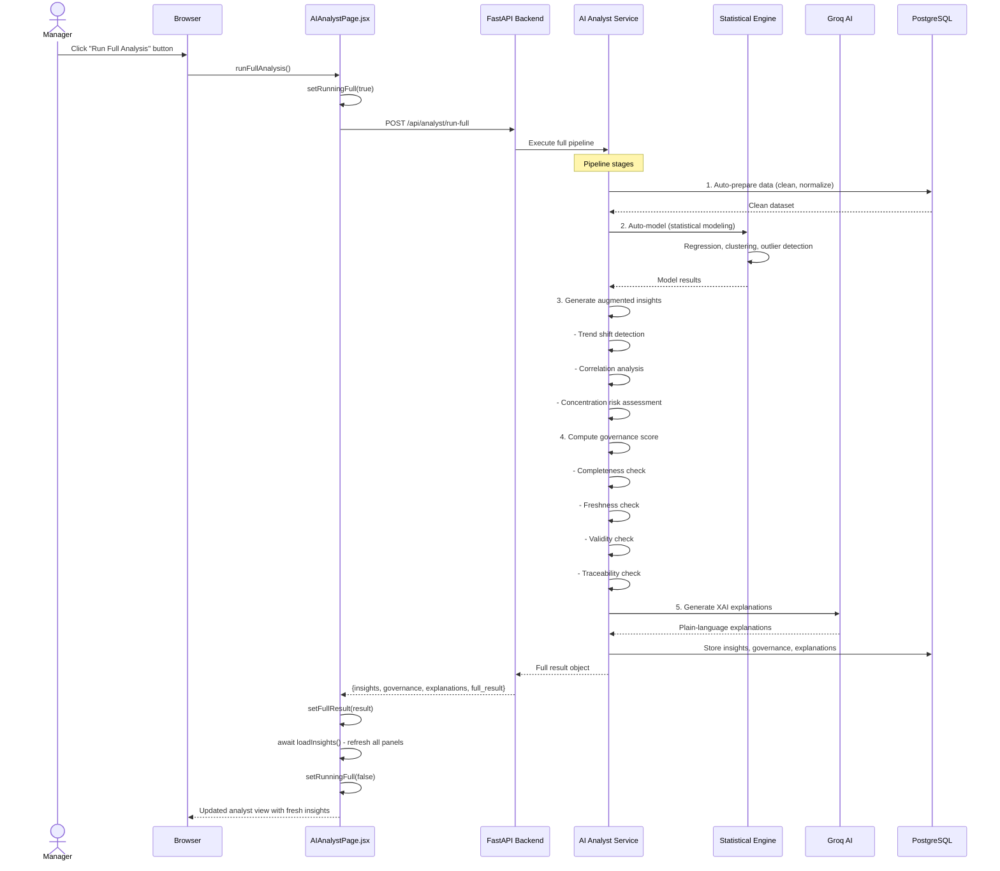
```mermaid
sequenceDiagram
    actor M as Manager
    participant BR as Browser
    participant React as AIAnalystPage.jsx
    participant BE as FastAPI Backend
    participant AI as AI Analyst Service
    participant Stats as Statistical Engine
    participant Groq as Groq AI
    participant DB as PostgreSQL

    M->>BR: Click "Run Full Analysis" button
    BR->>React: runFullAnalysis()
    React->>React: setRunningFull(true)
    React->>BE: POST /api/analyst/run-full
    BE->>AI: Execute full pipeline

    Note over AI: Pipeline stages
    AI->>DB: 1. Auto-prepare data (clean, normalize)
    DB-->>AI: Clean dataset
    AI->>Stats: 2. Auto-model (statistical modeling)
    Stats->>Stats: Regression, clustering, outlier detection
    Stats-->>AI: Model results
    AI->>AI: 3. Generate augmented insights
    AI->>AI: - Trend shift detection
    AI->>AI: - Correlation analysis
    AI->>AI: - Concentration risk assessment
    AI->>AI: 4. Compute governance score
    AI->>AI: - Completeness check
    AI->>AI: - Freshness check
    AI->>AI: - Validity check
    AI->>AI: - Traceability check
    AI->>Groq: 5. Generate XAI explanations
    Groq-->>AI: Plain-language explanations
    AI->>DB: Store insights, governance, explanations
    AI-->>BE: Full result object

    BE-->>React: {insights, governance, explanations, full_result}
    React->>React: setFullResult(result)
    React->>React: await loadInsights() - refresh all panels
    React->>React: setRunningFull(false)
    React-->>BR: Updated analyst view with fresh insights
```

### 3.3 Governance Score View

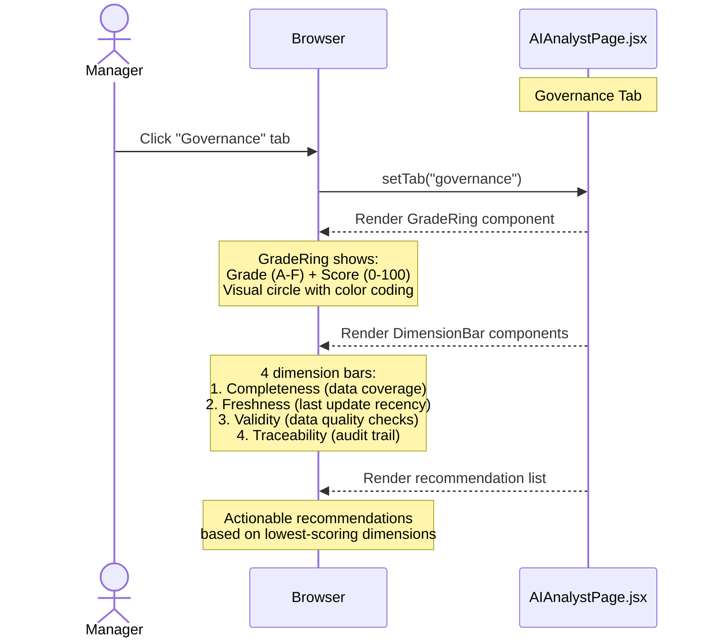
```mermaid
sequenceDiagram
    actor M as Manager
    participant BR as Browser
    participant React as AIAnalystPage.jsx

    Note over React: Governance Tab
    M->>BR: Click "Governance" tab
    BR->>React: setTab("governance")

    React-->>BR: Render GradeRing component
    Note over BR: GradeRing shows:<br/>Grade (A-F) + Score (0-100)<br/>Visual circle with color coding

    React-->>BR: Render DimensionBar components
    Note over BR: 4 dimension bars:<br/>1. Completeness (data coverage)<br/>2. Freshness (last update recency)<br/>3. Validity (data quality checks)<br/>4. Traceability (audit trail)

    React-->>BR: Render recommendation list
    Note over BR: Actionable recommendations<br/>based on lowest-scoring dimensions
```

### 3.4 Collaboration - Save Snapshot

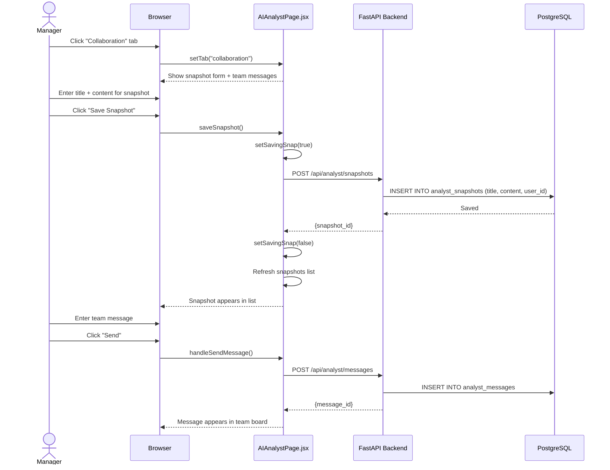
```mermaid
sequenceDiagram
    actor M as Manager
    participant BR as Browser
    participant React as AIAnalystPage.jsx
    participant BE as FastAPI Backend
    participant DB as PostgreSQL

    M->>BR: Click "Collaboration" tab
    BR->>React: setTab("collaboration")
    React-->>BR: Show snapshot form + team messages

    M->>BR: Enter title + content for snapshot
    M->>BR: Click "Save Snapshot"
    BR->>React: saveSnapshot()
    React->>React: setSavingSnap(true)
    React->>BE: POST /api/analyst/snapshots
    BE->>DB: INSERT INTO analyst_snapshots (title, content, user_id)
    DB-->>BE: Saved
    BE-->>React: {snapshot_id}
    React->>React: setSavingSnap(false)
    React->>React: Refresh snapshots list
    React-->>BR: Snapshot appears in list

    M->>BR: Enter team message
    M->>BR: Click "Send"
    BR->>React: handleSendMessage()
    React->>BE: POST /api/analyst/messages
    BE->>DB: INSERT INTO analyst_messages
    BE-->>React: {message_id}
    React-->>BR: Message appears in team board
```

---

## 4. Analysis Focus (Goal-Driven)

### 4.1 Run Analysis with Goal

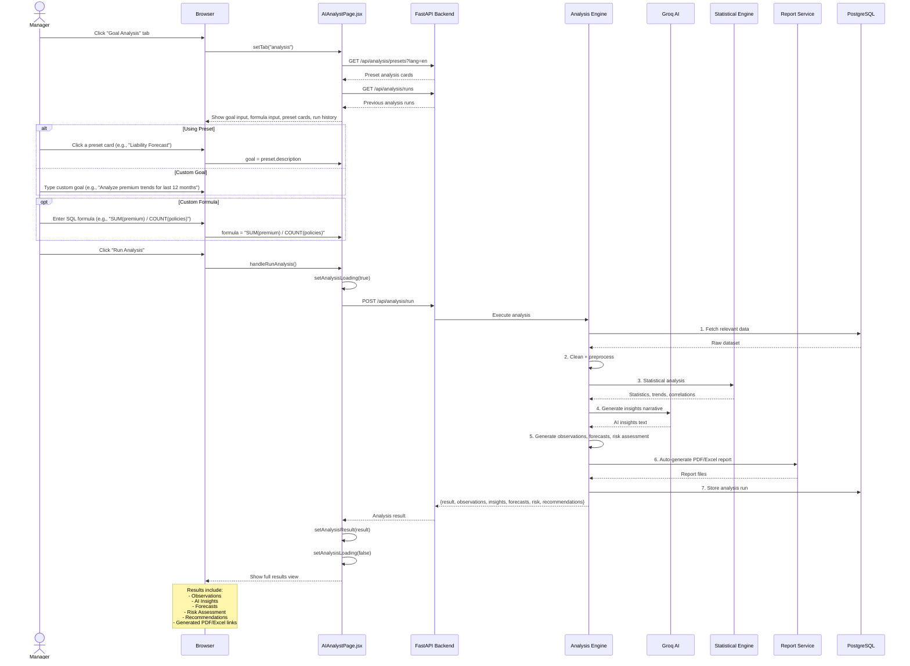
```mermaid
sequenceDiagram
    actor M as Manager
    participant BR as Browser
    participant React as AIAnalystPage.jsx
    participant BE as FastAPI Backend
    participant Engine as Analysis Engine
    participant Groq as Groq AI
    participant Stats as Statistical Engine
    participant Report as Report Service
    participant DB as PostgreSQL

    M->>BR: Click "Goal Analysis" tab
    BR->>React: setTab("analysis")
    React->>BE: GET /api/analysis/presets?lang=en
    BE-->>React: Preset analysis cards
    React->>BE: GET /api/analysis/runs
    BE-->>React: Previous analysis runs
    React-->>BR: Show goal input, formula input, preset cards, run history

    alt Using Preset
        M->>BR: Click a preset card (e.g., "Liability Forecast")
        BR->>React: goal = preset.description
    else Custom Goal
        M->>BR: Type custom goal (e.g., "Analyze premium trends for last 12 months")
    end

    opt Custom Formula
        M->>BR: Enter SQL formula (e.g., "SUM(premium) / COUNT(policies)")
        BR->>React: formula = "SUM(premium) / COUNT(policies)"
    end

    M->>BR: Click "Run Analysis"
    BR->>React: handleRunAnalysis()
    React->>React: setAnalysisLoading(true)
    React->>BE: POST /api/analysis/run
    BE->>Engine: Execute analysis

    Engine->>DB: 1. Fetch relevant data
    DB-->>Engine: Raw dataset
    Engine->>Engine: 2. Clean + preprocess
    Engine->>Stats: 3. Statistical analysis
    Stats-->>Engine: Statistics, trends, correlations
    Engine->>Groq: 4. Generate insights narrative
    Groq-->>Engine: AI insights text
    Engine->>Engine: 5. Generate observations, forecasts, risk assessment
    Engine->>Report: 6. Auto-generate PDF/Excel report
    Report-->>Engine: Report files
    Engine->>DB: 7. Store analysis run
    Engine-->>BE: {result, observations, insights, forecasts, risk, recommendations}

    BE-->>React: Analysis result
    React->>React: setAnalysisResult(result)
    React->>React: setAnalysisLoading(false)
    React-->>BR: Show full results view
    Note over BR: Results include:<br/>- Observations<br/>- AI Insights<br/>- Forecasts<br/>- Risk Assessment<br/>- Recommendations<br/>- Generated PDF/Excel links
```

### 4.2 View Previous Analysis Run

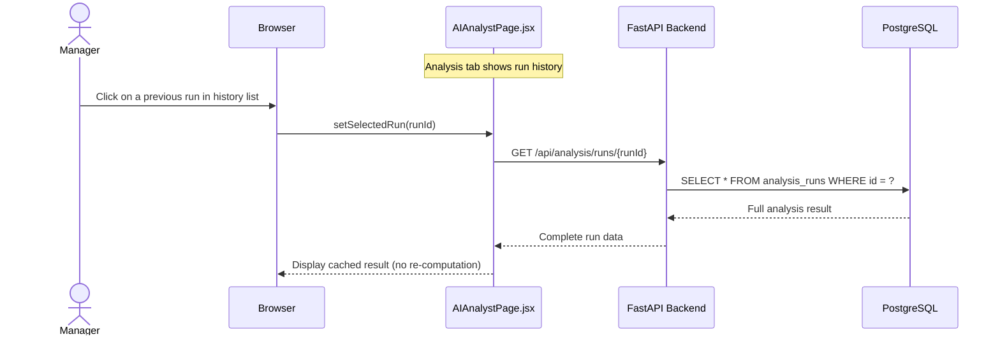
```mermaid
sequenceDiagram
    actor M as Manager
    participant BR as Browser
    participant React as AIAnalystPage.jsx
    participant BE as FastAPI Backend
    participant DB as PostgreSQL

    Note over React: Analysis tab shows run history
    M->>BR: Click on a previous run in history list
    BR->>React: setSelectedRun(runId)
    React->>BE: GET /api/analysis/runs/{runId}
    BE->>DB: SELECT * FROM analysis_runs WHERE id = ?
    DB-->>BE: Full analysis result
    BE-->>React: Complete run data
    React-->>BR: Display cached result (no re-computation)
```

---

## 5. Ask Your Data (NLQ)

### 5.1 Natural Language Query Flow

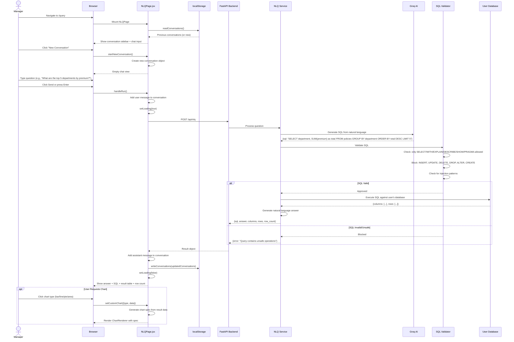
```mermaid
sequenceDiagram
    actor M as Manager
    participant BR as Browser
    participant React as NLQPage.jsx
    participant Cache as localStorage
    participant BE as FastAPI Backend
    participant NLQ as NLQ Service
    participant Groq as Groq AI
    participant Validator as SQL Validator
    participant DB as User Database

    M->>BR: Navigate to /query
    BR->>React: Mount NLQPage
    React->>Cache: readConversations()
    Cache-->>React: Previous conversations (or new)
    React-->>BR: Show conversation sidebar + chat input

    M->>BR: Click "New Conversation"
    BR->>React: startNewConversation()
    React->>React: Create new conversation object
    React-->>BR: Empty chat view

    M->>BR: Type question (e.g., "What are the top 5 departments by premium?")
    M->>BR: Click Send or press Enter
    BR->>React: handleRun()
    React->>React: Add user message to conversation
    React->>React: setLoading(true)
    React->>BE: POST /api/nlq
    BE->>NLQ: Process question

    NLQ->>Groq: Generate SQL from natural language
    Groq-->>NLQ: {sql: "SELECT department, SUM(premium) as total FROM policies GROUP BY department ORDER BY total DESC LIMIT 5"}
    NLQ->>Validator: Validate SQL
    Validator->>Validator: Check: only SELECT/WITH/EXPLAIN/DESCRIBE/SHOW/PRAGMA allowed
    Validator->>Validator: Block: INSERT, UPDATE, DELETE, DROP, ALTER, CREATE
    Validator->>Validator: Check for injection patterns

    alt SQL Valid
        Validator-->>NLQ: Approved
        NLQ->>DB: Execute SQL against user's database
        DB-->>NLQ: {columns: [...], rows: [...]}
        NLQ->>NLQ: Generate natural language answer
        NLQ-->>BE: {sql, answer, columns, rows, row_count}
    else SQL Invalid/Unsafe
        Validator-->>NLQ: Blocked
        NLQ-->>BE: {error: "Query contains unsafe operations"}
    end

    BE-->>React: Result object
    React->>React: Add assistant message to conversation
    React->>Cache: writeConversations(updatedConversations)
    React->>React: setLoading(false)
    React-->>BR: Show answer + SQL + result table + row count

    opt User Requests Chart
        M->>BR: Click chart type (bar/line/pie/area)
        BR->>React: setCustomChart({type, data})
        React->>React: Generate chart spec from result data
        React-->>BR: Render ChartRenderer with spec
    end
```

### 5.2 Conversation History Management

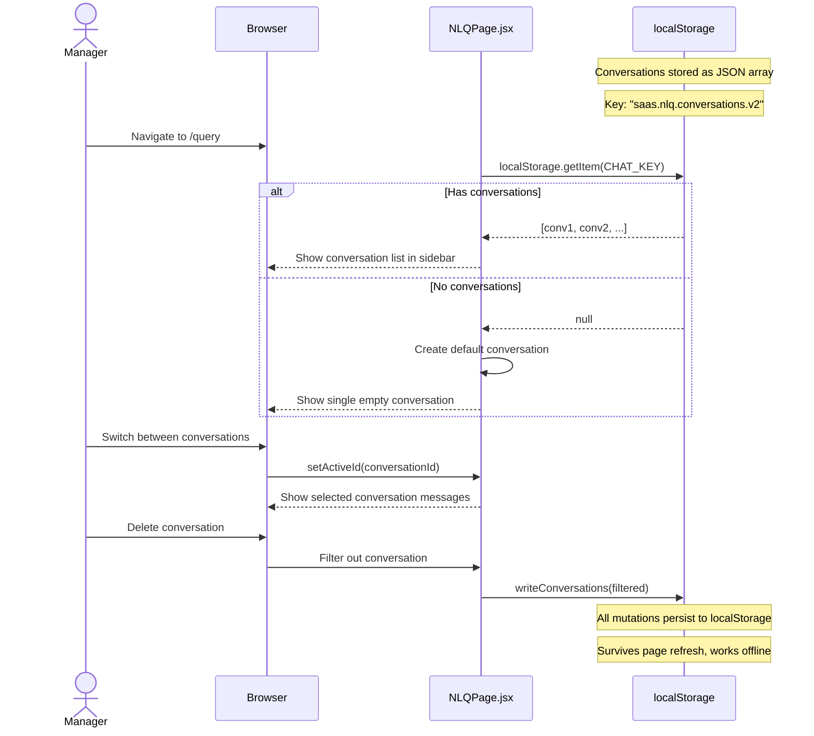
```mermaid
sequenceDiagram
    actor M as Manager
    participant BR as Browser
    participant React as NLQPage.jsx
    participant Cache as localStorage

    Note over Cache: Conversations stored as JSON array
    Note over Cache: Key: "saas.nlq.conversations.v2"

    M->>BR: Navigate to /query
    React->>Cache: localStorage.getItem(CHAT_KEY)
    alt Has conversations
        Cache-->>React: [conv1, conv2, ...]
        React-->>BR: Show conversation list in sidebar
    else No conversations
        Cache-->>React: null
        React->>React: Create default conversation
        React-->>BR: Show single empty conversation
    end

    M->>BR: Switch between conversations
    BR->>React: setActiveId(conversationId)
    React-->>BR: Show selected conversation messages

    M->>BR: Delete conversation
    BR->>React: Filter out conversation
    React->>Cache: writeConversations(filtered)

    Note over Cache: All mutations persist to localStorage
    Note over Cache: Survives page refresh, works offline
```

---

## 6. Validation History Flow

### 6.1 Validation Log Viewer

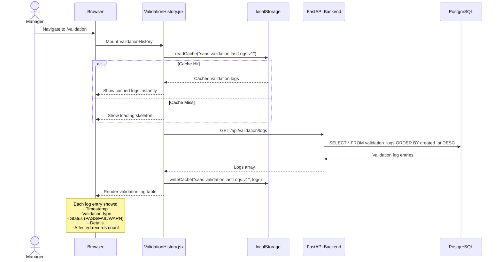
```mermaid
sequenceDiagram
    actor M as Manager
    participant BR as Browser
    participant React as ValidationHistory.jsx
    participant Cache as localStorage
    participant BE as FastAPI Backend
    participant DB as PostgreSQL

    M->>BR: Navigate to /validation
    BR->>React: Mount ValidationHistory
    React->>Cache: readCache("saas.validation.lastLogs.v1")
    alt Cache Hit
        Cache-->>React: Cached validation logs
        React-->>BR: Show cached logs instantly
    else Cache Miss
        React-->>BR: Show loading skeleton
    end

    React->>BE: GET /api/validation/logs
    BE->>DB: SELECT * FROM validation_logs ORDER BY created_at DESC
    DB-->>BE: Validation log entries
    BE-->>React: Logs array
    React->>Cache: writeCache("saas.validation.lastLogs.v1", logs)
    React-->>BR: Render validation log table

    Note over BR: Each log entry shows:<br/>- Timestamp<br/>- Validation type<br/>- Status (PASS/FAIL/WARN)<br/>- Details<br/>- Affected records count
```

---

## 7. Schema Explorer Flow

### 7.1 Database Introspection

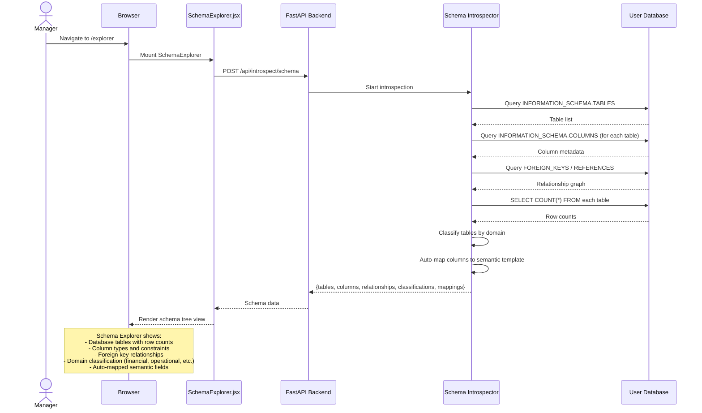
```mermaid
sequenceDiagram
    actor M as Manager
    participant BR as Browser
    participant React as SchemaExplorer.jsx
    participant BE as FastAPI Backend
    participant Intro as Schema Introspector
    participant DB as User Database

    M->>BR: Navigate to /explorer
    BR->>React: Mount SchemaExplorer
    React->>BE: POST /api/introspect/schema
    BE->>Intro: Start introspection
    Intro->>DB: Query INFORMATION_SCHEMA.TABLES
    DB-->>Intro: Table list
    Intro->>DB: Query INFORMATION_SCHEMA.COLUMNS (for each table)
    DB-->>Intro: Column metadata
    Intro->>DB: Query FOREIGN_KEYS / REFERENCES
    DB-->>Intro: Relationship graph
    Intro->>DB: SELECT COUNT(*) FROM each table
    DB-->>Intro: Row counts
    Intro->>Intro: Classify tables by domain
    Intro->>Intro: Auto-map columns to semantic template
    Intro-->>BE: {tables, columns, relationships, classifications, mappings}
    BE-->>React: Schema data
    React-->>BR: Render schema tree view

    Note over BR: Schema Explorer shows:<br/>- Database tables with row counts<br/>- Column types and constraints<br/>- Foreign key relationships<br/>- Domain classification (financial, operational, etc.)<br/>- Auto-mapped semantic fields
```

### 7.2 Auto-Map to Dashboard KPIs

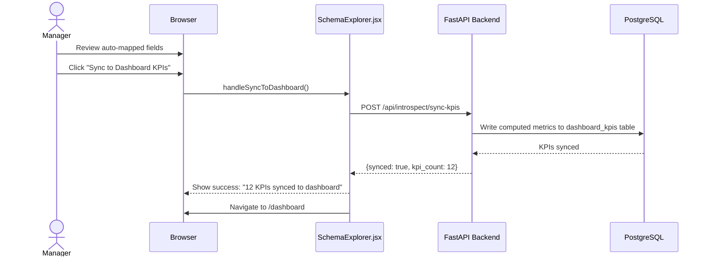
```mermaid
sequenceDiagram
    actor M as Manager
    participant BR as Browser
    participant React as SchemaExplorer.jsx
    participant BE as FastAPI Backend
    participant DB as PostgreSQL

    M->>BR: Review auto-mapped fields
    M->>BR: Click "Sync to Dashboard KPIs"
    BR->>React: handleSyncToDashboard()
    React->>BE: POST /api/introspect/sync-kpis
    BE->>DB: Write computed metrics to dashboard_kpis table
    DB-->>BE: KPIs synced
    BE-->>React: {synced: true, kpi_count: 12}
    React-->>BR: Show success: "12 KPIs synced to dashboard"
    React->>BR: Navigate to /dashboard
```

### 7.3 Ready-to-Run Analyses

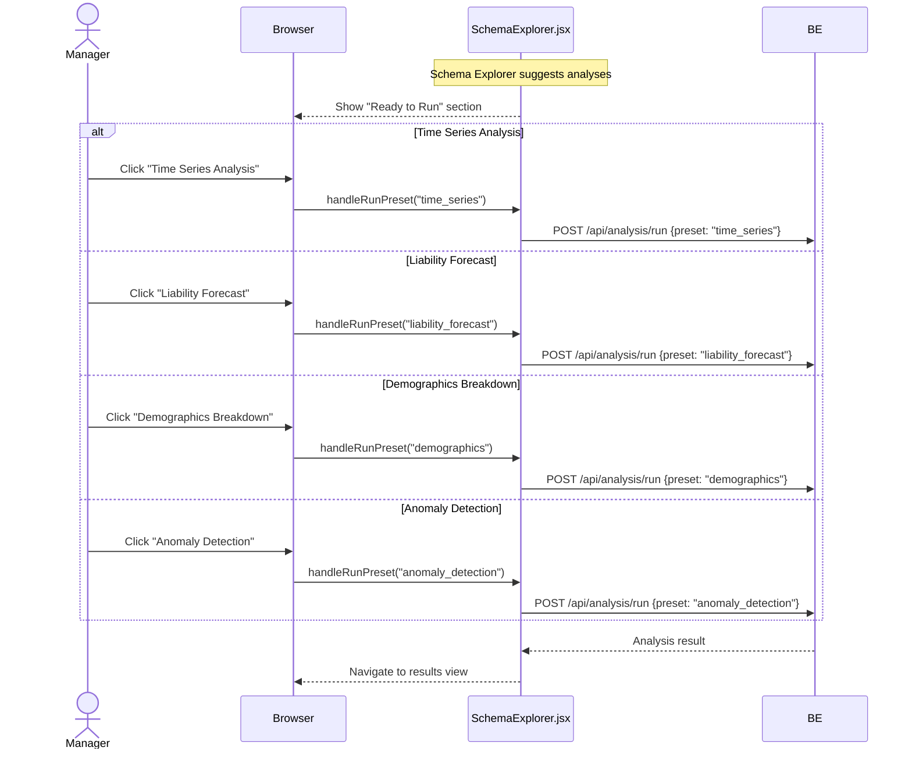
```mermaid
sequenceDiagram
    actor M as Manager
    participant BR as Browser
    participant React as SchemaExplorer.jsx

    Note over React: Schema Explorer suggests analyses
    React-->>BR: Show "Ready to Run" section

    alt Time Series Analysis
        M->>BR: Click "Time Series Analysis"
        BR->>React: handleRunPreset("time_series")
        React->>BE: POST /api/analysis/run {preset: "time_series"}
    else Liability Forecast
        M->>BR: Click "Liability Forecast"
        BR->>React: handleRunPreset("liability_forecast")
        React->>BE: POST /api/analysis/run {preset: "liability_forecast"}
    else Demographics Breakdown
        M->>BR: Click "Demographics Breakdown"
        BR->>React: handleRunPreset("demographics")
        React->>BE: POST /api/analysis/run {preset: "demographics"}
    else Anomaly Detection
        M->>BR: Click "Anomaly Detection"
        BR->>React: handleRunPreset("anomaly_detection")
        React->>BE: POST /api/analysis/run {preset: "anomaly_detection"}
    end

    BE-->>React: Analysis result
    React-->>BR: Navigate to results view
```

---

## 8. Custom Report Flow

### 8.1 Custom Report Builder

```mermaid
sequenceDiagram
    actor M as Manager
    participant BR as Browser
    participant React as CustomReportPage.jsx
    participant BE as FastAPI Backend
    participant Report as Report Service
    participant Groq as Groq AI
    participant PDF as PDF Generator
    participant DB as PostgreSQL

    M->>BR: Navigate to /reports/custom
    BR->>React: Mount CustomReportPage
    React-->>BR: Show report builder form

    M->>BR: Select scope (All data / Specific department / Date range)
    M->>BR: Select format (PDF / Excel / Both)
    M->>BR: Enter custom instructions (e.g., "Focus on Q1 claims analysis")
    M->>BR: Click "Generate Report"
    BR->>React: handleGenerate()
    React->>BE: POST /api/reports/custom
    BE->>Report: Generate custom report
    Report->>DB: Fetch data based on scope
    DB-->>Report: Dataset
    Report->>Groq: Generate narrative with custom instructions
    Groq-->>Report: AI narrative
    Report->>PDF: Create report with narrative + charts
    PDF-->>Report: PDF file
    Report->>DB: Store report metadata
    Report-->>BE: {report_id, download_url}
    BE-->>React: Report ready
    React-->>BR: Show download link + preview
    M->>BR: Click download
    BR->>BE: GET /api/reports/{report_id}/download
    BE-->>BR: PDF file stream
```

---

## 9. Settings Flow

### 9.1 Settings Page Load

```mermaid
sequenceDiagram
    actor M as Manager
    participant BR as Browser
    participant React as Settings.jsx
    participant Cache as localStorage
    participant BE as FastAPI Backend
    participant DB as PostgreSQL

    M->>BR: Navigate to /settings
    BR->>React: Mount Settings
    React->>Cache: Read theme, language preferences
    React->>BE: GET /api/settings/connection
    BE->>DB: SELECT * FROM db_connections WHERE user_id = ?
    DB-->>BE: Saved connection config (encrypted)
    BE-->>React: Connection settings
    React-->>BR: Show 5 settings sections

    Note over BR: Settings sections:<br/>1. Language (EN/FR)<br/>2. Database Connection<br/>3. Custom Formulas<br/>4. Semantic Mapping<br/>5. AI Narrative Settings<br/>6. Account Management
```

### 9.2 Database Connection Configuration

```mermaid
sequenceDiagram
    actor M as Manager
    participant BR as Browser
    participant React as Settings.jsx
    participant BE as FastAPI Backend
    participant Crypto as Fernet Encryption
    participant DB as User Database

    M->>BR: Select database type (PostgreSQL/MySQL/Oracle/MongoDB/SQLite/SQL Server)
    BR->>React: setDbType(type)
    M->>BR: Select connection method
    Note over BR: Options:<br/>1. Direct connection<br/>2. Cloudflare Tunnel<br/>3. SSH Tunnel<br/>4. Docker VPN

    M->>BR: Enter host, port, database, username, password
    M->>BR: Click "Test Connection"
    BR->>BE: POST /api/settings/test-connection
    BE->>Crypto: Encrypt credentials with Fernet
    BE->>DB: Attempt connection with credentials
    alt Connection Success
        DB-->>BE: Connected
        BE-->>React: {success: true, version: "PostgreSQL 15.2"}
        React-->>BR: Green checkmark + version info
    else Connection Failed
        DB-->>BE: Error
        BE-->>React: {success: false, error: "Connection refused"}
        React-->>BR: Red error message
    end

    M->>BR: Click "Save Connection"
    BR->>BE: POST /api/settings/connection
    BE->>Crypto: Encrypt password
    BE->>DB: INSERT/UPDATE db_connections
    DB-->>BE: Saved
    BE-->>React: {saved: true}
    React-->>BR: Success notification
```

### 9.3 AI Narrative Settings

```mermaid
sequenceDiagram
    actor M as Manager
    participant BR as Browser
    participant React as Settings.jsx
    participant BE as FastAPI Backend
    participant DB as PostgreSQL

    M->>BR: Navigate to AI Narrative section
    BR-->>BR: Show narrative settings form

    M->>BR: Set tone (Insight-driven / Formal)
    M->>BR: Set sync frequency (Daily / Weekly / Monthly)
    M->>BR: Set analysis focus (e.g., "Claims, Premiums, Risk")
    M->>BR: Add email recipients for reports
    M->>BR: Click "Save Preferences"
    BR->>BE: POST /api/settings/narrative
    BE->>DB: UPDATE user_preferences SET narrative_config = ?
    DB-->>BE: Saved
    BE-->>React: {saved: true}
    React-->>BR: Settings saved notification
```

### 9.4 Theme & Language Toggle

```mermaid
sequenceDiagram
    actor M as Manager
    participant BR as Browser
    participant React as AppShell
    participant Cache as localStorage

    M->>BR: Toggle dark/light mode
    BR->>React: setIsDark(!isDark)
    React->>Cache: localStorage.setItem('ea-theme', isDark ? 'dark' : 'light')
    React->>React: document.documentElement.classList.toggle('light-theme')
    React-->>BR: Theme changes instantly

    M->>BR: Change language (EN → FR)
    BR->>React: setLang('fr')
    React->>Cache: localStorage.setItem('saas.language', 'fr')
    React->>React: All t() calls return French text
    React-->>BR: UI text updates to French
```

---

## 10. Offline Mode Architecture

### 10.1 Offline Detection & Fallback Strategy

```mermaid
sequenceDiagram
    actor M as Manager
    participant BR as Browser
    participant React as React App
    participant Banner as OfflineBanner
    participant SW as Service Worker
    participant Cache as Cache API
    participant LS as localStorage
    participant BE as FastAPI Backend

    Note over BR: Network state monitoring
    alt navigator.onLine = true
        React->>Banner: Set offline = false
        Banner-->>BR: No banner shown
    else navigator.onLine = false
        React->>Banner: Set offline = true
        Banner-->>BR: Show sticky "Offline mode" banner
    end

    Note over React: Every API call checks network
    React->>BE: apiFetch('/api/...')
    alt Online + Network OK
        BE-->>React: Fresh data from server
        React->>LS: Cache response for offline use
    else Offline or Network Error
        BE-->>React: TypeError (fetch failed)
        React->>LS: readCache(CACHE_KEY)
        alt Cache Hit
            LS-->>React: Cached data
            React-->>BR: Show cached data (stale indicator)
        else Cache Miss
            LS-->>React: null
            React-->>BR: Show "No data available offline" message
        end
    end
```

### 10.2 Page-Level Offline Fallback Matrix

```
┌─────────────────────┬──────────────┬───────────────────────────────────────┐
│ Page                │ Cache Key    │ Offline Behavior                      │
├─────────────────────┼──────────────┼───────────────────────────────────────┤
│ Dashboard           │ saas.        │ Show last cached KPIs, narrative,     │
│                     │ dashboard.   │ anomalies with "stale" badge          │
│                     │ lastSummary  │                                       │
│                     │ .v2          │                                       │
├─────────────────────┼──────────────┼───────────────────────────────────────┤
│ Validation History  │ saas.        │ Show last cached validation logs      │
│                     │ validation.  │                                       │
│                     │ lastLogs.v1  │                                       │
├─────────────────────┼──────────────┼───────────────────────────────────────┤
│ NLQ (Ask Your Data) │ saas.nlq.    │ Show conversation history,            │
│                     │ conversations│ new queries show "offline" error      │
│                     │ .v2          │                                       │
├─────────────────────┼──────────────┼───────────────────────────────────────┤
│ AI Analyst          │ (none)       │ Show "Offline: cannot run analysis"   │
│                     │              │ Load cached insights if available     │
├─────────────────────┼──────────────┼───────────────────────────────────────┤
│ Schema Explorer     │ (none)       │ Show "Offline: cannot introspect"     │
├─────────────────────┼──────────────┼───────────────────────────────────────┤
│ Settings            │ ea-theme,    │ Theme/language changes work offline   │
│                     │ saas.lang   │ DB connection changes need online      │
│                     │ uage        │                                       │
├─────────────────────┼──────────────┼───────────────────────────────────────┤
│ Reports             │ (none)      │ Show cached reports list,             │
│                     │              │ no generation offline                 │
├─────────────────────┼──────────────┼───────────────────────────────────────┤
│ Custom Reports      │ (none)      │ Show "Offline: cannot generate"       │
└─────────────────────┴──────────────┴───────────────────────────────────────┘
```

### 10.3 Service Worker Caching Strategy

```mermaid
sequenceDiagram
    participant BR as Browser
    participant SW as Service Worker
    participant Cache as Cache API
    participant Net as Network
    participant BE as FastAPI Backend

    Note over SW: Service Worker Registration
    BR->>SW: navigator.serviceWorker.register('/sw.js')
    SW->>SW: install event → precache app shell
    SW->>Cache: Pre-cache: index.html, all JS, CSS, icons
    SW->>SW: activate event → cleanup old caches

    Note over SW: Request Interception
    BR->>SW: fetch('/api/summary')
    SW->>SW: Check URL pattern match

    alt API Request - NetworkFirst Strategy
        SW->>Net: fetch(request)
        alt Network OK
            Net-->>SW: Response (200)
            SW->>Cache: Cache response (TTL-based)
            SW-->>BR: Return fresh response
        else Network Fail
            Net-->>SW: Error
            SW->>Cache: Match cached response
            alt Cache Hit
                Cache-->>SW: Cached response
                SW-->>BR: Return cached (stale) response
            else Cache Miss
                SW-->>BR: Return offline fallback page
            end
        end
    else Static Asset - CacheFirst Strategy
        SW->>Cache: Match cached asset
        alt Cache Hit
            Cache-->>SW: Cached asset
            SW-->>BR: Return immediately (fast)
            SW->>Net: fetch(request) in background
            Net-->>SW: Updated asset
            SW->>Cache: Update cache
        else Cache Miss
            SW->>Net: fetch(request)
            Net-->>SW: Fresh asset
            SW->>Cache: Cache for next time
            SW-->>BR: Return response
        end
    end
```

### 10.4 Background Sync for Queued Actions (Proposed)

```mermaid
sequenceDiagram
    actor M as Manager
    participant BR as Browser
    participant React as React App
    participant SW as Service Worker
    participant IDB as IndexedDB
    participant BE as FastAPI Backend

    Note over M,IDB: User performs actions while offline
    M->>BR: Click "Save Snapshot" while offline
    BR->>React: handleSaveSnapshot()
    React->>React: Check navigator.onLine
    React->>IDB: Store action in outbox queue
    IDB-->>React: Saved with timestamp + action type
    React-->>BR: Show "Queued for sync" indicator

    Note over M,IDB: More offline actions
    M->>BR: Send team message while offline
    React->>IDB: Queue: {type: "message", data: {...}}
    M->>BR: Update settings
    React->>IDB: Queue: {type: "settings", data: {...}}

    Note over BR: Network restored
    BR->>React: navigator.onLine = true event
    React->>React: Set online = true
    React->>Banner: Hide offline banner
    React->>IDB: Drain outbox queue

    loop For each queued action
        React->>BE: Execute queued API call
        alt Success
            BE-->>React: 200 OK
            React->>IDB: Remove from queue
        else Failure
            BE-->>React: Error
            React->>IDB: Keep in queue, retry later
        end
    end

    React-->>BR: Show "Synced 3 queued actions"
```

### 10.5 PWA Install & Update Flow

```mermaid
sequenceDiagram
    actor M as Manager
    participant BR as Browser
    participant Prompt as ReloadPrompt
    participant SW as Service Worker
    participant Cache as Cache API

    Note over M: First visit - PWA installable
    BR->>Prompt: beforeinstallprompt event
    Prompt-->>M: Show "Install App" banner
    M->>Prompt: Click "Install"
    Prompt->>BR: prompt.prompt()
    BR-->>M: Browser install dialog
    M->>BR: Confirm install
    BR->>SW: Install PWA
    SW->>Cache: Pre-cache all assets

    Note over M: Subsequent visit - SW update available
    BR->>SW: New service worker detected
    SW->>Cache: New assets cached
    SW-->>Prompt: Update available event
    Prompt-->>M: Show "Update available" banner
    M->>Prompt: Click "Reload"
    Prompt->>BR: window.location.reload()
    BR->>SW: Activate new service worker
    SW->>SW: Skip waiting (skipWaiting)
    SW->>Cache: Cleanup outdated caches
    BR->>BR: Fresh app loaded
```

---

## 11. Service Worker Lifecycle

### 11.1 Current State (IMPORTANT)

The app currently **unregisters all service workers** on page load in `main.jsx`:

```javascript
if ('serviceWorker' in navigator) {
  window.addEventListener('load', () => {
    navigator.serviceWorker.getRegistrations().then((regs) => {
      regs.forEach((reg) => reg.unregister())
    })
  })
}
```

### 11.2 Recommended Fix for Offline Support

```mermaid
sequenceDiagram
    participant React as main.jsx
    participant SW as Service Worker
    participant VPWA as vite-plugin-pwa

    Note over React: CURRENT (broken)
    React->>SW: getRegistrations()
    React->>SW: unregister() ← KILLS offline support

    Note over React: RECOMMENDED FIX
    React->>SW: Remove unregister code
    React->>VPWA: Let vite-plugin-pwa handle registration
    VPWA->>SW: registerSW({ immediate: true })
    SW->>SW: install → precache all assets
    SW->>SW: activate → claim clients
    SW->>SW: Ready for offline interception
```

### 11.3 Required Cache Rules for Full Offline

```javascript
// vite.config.js - Additional runtimeCaching needed
runtimeCaching: [
  {
    urlPattern: /\/api\/nlq$/,
    handler: 'NetworkFirst',
    options: { cacheName: 'nlq-cache', expiration: { maxEntries: 20, maxAgeSeconds: 300 }}
  },
  {
    urlPattern: /\/api\/analyst\/(insights|governance|explain)/,
    handler: 'NetworkFirst',
    options: { cacheName: 'analyst-cache', expiration: { maxEntries: 10, maxAgeSeconds: 600 }}
  },
  {
    urlPattern: /\/api\/settings/,
    handler: 'NetworkFirst',
    options: { cacheName: 'settings-cache', expiration: { maxEntries: 5, maxAgeSeconds: 600 }}
  },
  {
    urlPattern: /\/api\/introspect/,
    handler: 'NetworkOnly',  // Schema too large to cache
  },
  {
    urlPattern: /\/api\/validation\/logs/,
    handler: 'NetworkFirst',
    options: { cacheName: 'validation-cache', expiration: { maxEntries: 10, maxAgeSeconds: 300 }}
  },
  {
    urlPattern: /\/api\/reports/,
    handler: 'NetworkFirst',
    options: { cacheName: 'reports-cache', expiration: { maxEntries: 20, maxAgeSeconds: 300 }}
  },
]
```

---

## Summary: Complete Manager Flow Map

```
┌──────────────────────────────────────────────────────────────────┐
│                        MANAGER FLOW MAP                          │
├──────────────────────────────────────────────────────────────────┤
│                                                                  │
│  App Launch                                                      │
│    │                                                             │
│    ▼                                                             │
│  ┌─────────┐   No Session   ┌──────────┐                        │
│  │  Auth    │───────────────▶│  Login   │                        │
│  │  Check   │                │  Screen  │                        │
│  └────┬────┘                └────┬─────┘                        │
│       │ Session                   │ Sign In / Sign Up            │
│       ▼                           ▼                              │
│  ┌──────────────────────────────────────┐                        │
│  │           DASHBOARD                   │                        │
│  │  ┌──────────┬──────────┬──────────┐  │                        │
│  │  │ Overview │ Analytics│Executive │  │                        │
│  │  └────┬─────┴────┬─────┴────┬─────┘  │                        │
│  │       │          │          │         │                        │
│  │    KPIs      Narrative   Health      │                        │
│  │    Charts    Forecasts   Risks       │                        │
│  │    Widgets   Map         Reports     │                        │
│  └──────┬──────────┬──────────┬─────────┘                        │
│         │          │          │                                   │
│    ┌────┴────┐ ┌───┴────┐ ┌──┴──────┐                          │
│    │  Sync   │ │Report  │ │Onboard  │                          │
│    │  Now    │ │Generate│ │Tour     │                          │
│    └────┬────┘ └───┬────┘ └─────────┘                          │
│         │          │                                             │
│         ▼          ▼                                             │
│  ┌──────────────────────────────────────┐                        │
│  │         NAVIGATION SIDEBAR            │                        │
│  │                                       │                        │
│  │  ┌──────────┐  ┌──────────────┐      │                        │
│  │  │ Analyst  │  │ Ask Your Data│      │                        │
│  │  │ (5 tabs) │  │   (NLQ)      │      │                        │
│  │  ├──────────┤  ├──────────────┤      │                        │
│  │  │Insights  │  │ Chat-based   │      │                        │
│  │  │Goals     │  │ SQL queries  │      │                        │
│  │  │Governance│  │ Charts       │      │                        │
│  │  │XAI       │  │ History      │      │                        │
│  │  │Collab    │  │              │      │                        │
│  │  └──────────┘  └──────────────┘      │                        │
│  │                                       │                        │
│  │  ┌──────────┐  ┌──────────────┐      │                        │
│  │  │Validation│  │Schema        │      │                        │
│  │  │ History  │  │ Explorer     │      │                        │
│  │  └──────────┘  └──────────────┘      │                        │
│  │                                       │                        │
│  │  ┌──────────┐  ┌──────────────┐      │                        │
│  │  │ Reports  │  │Custom Report │      │                        │
│  │  │ History  │  │  Builder     │      │                        │
│  │  └──────────┘  └──────────────┘      │                        │
│  │                                       │                        │
│  │  ┌──────────┐  ┌──────────────┐      │                        │
│  │  │Executive │  │ Data Quality │      │                        │
│  │  │Analytics │  │              │      │                        │
│  │  └──────────┘  └──────────────┘      │                        │
│  │                                       │                        │
│  │  ┌──────────┐                         │                        │
│  │  │ Settings │                         │                        │
│  │  │(5+ sects)│                         │                        │
│  │  └──────────┘                         │                        │
│  └──────────────────────────────────────┘                        │
│                                                                  │
│  ┌──────────────────────────────────────┐                        │
│  │         OFFLINE MODE                  │                        │
│  │                                       │                        │
│  │  Service Worker (precaching)          │                        │
│  │  localStorage (data caching)          │                        │
│  │  IndexedDB (action queue)             │                        │
│  │  Offline Banner (status indicator)    │                        │
│  │  Background Sync (queued actions)     │                        │
│  └──────────────────────────────────────┘                        │
│                                                                  │
└──────────────────────────────────────────────────────────────────┘
```

---

*Generated for CNPS Smart Automated Analytics System - Manager Side Flow Analysis*
*Date: July 2026*
